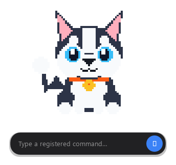
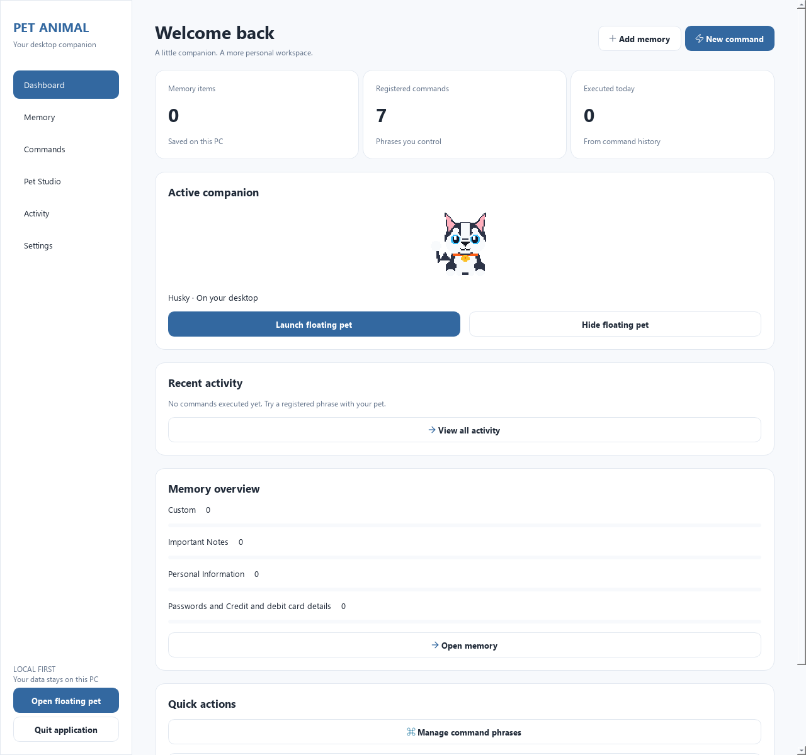
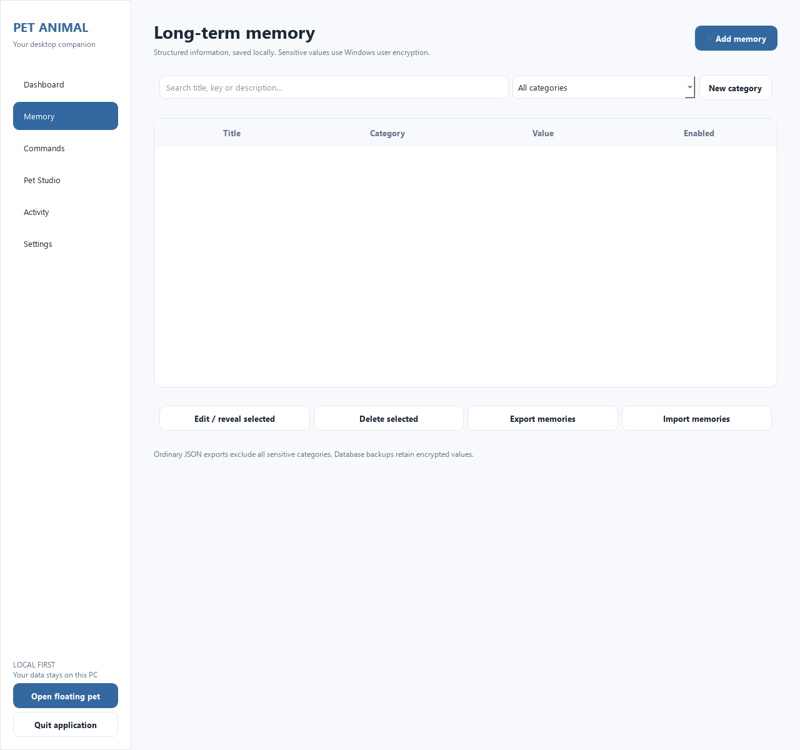
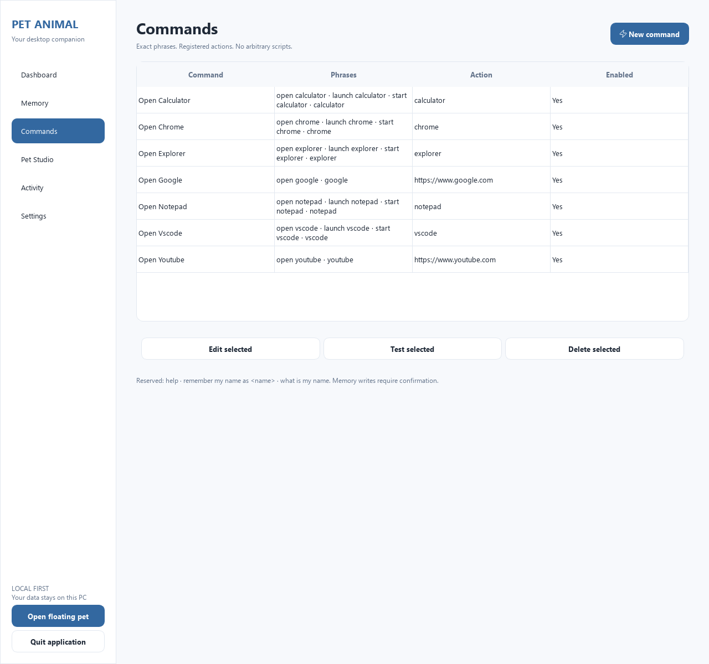
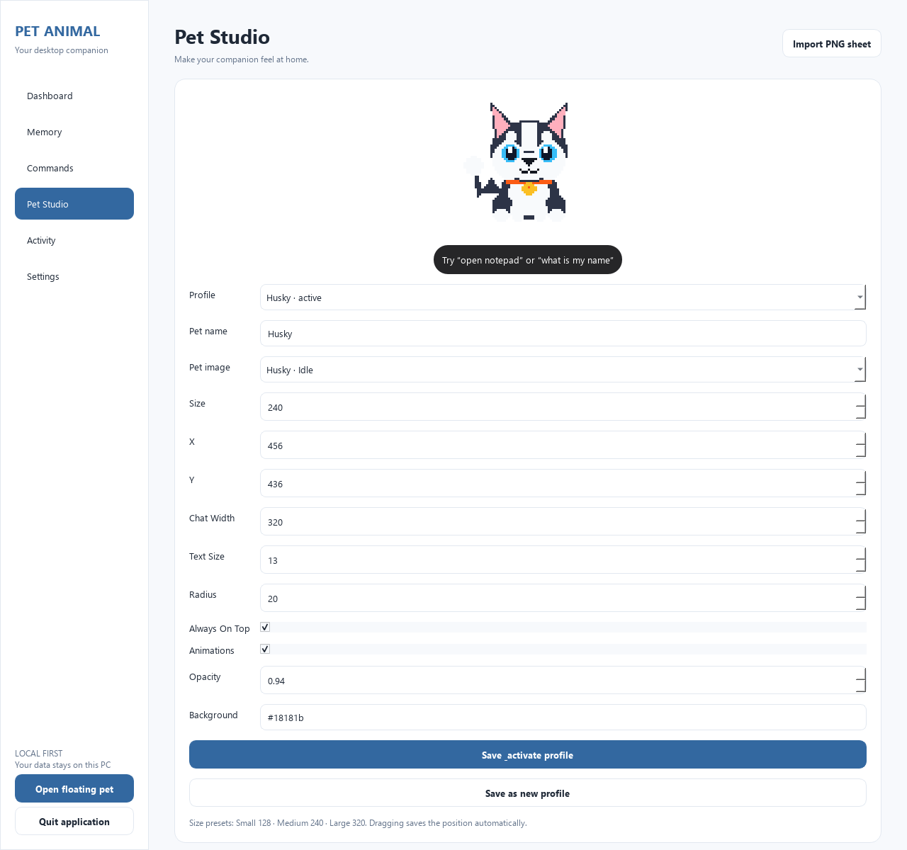
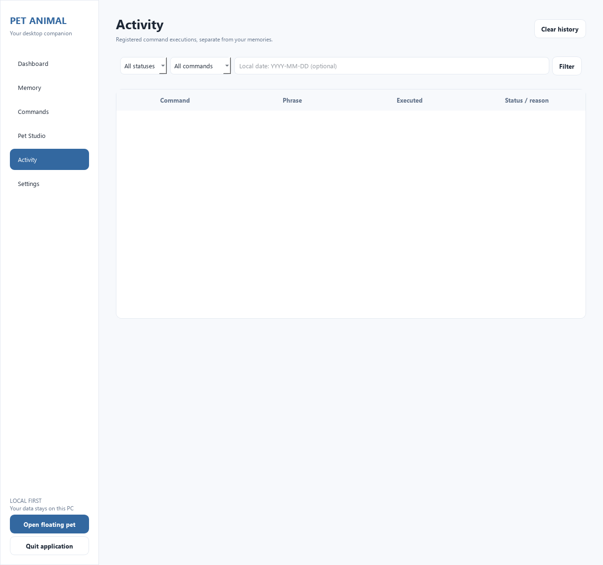
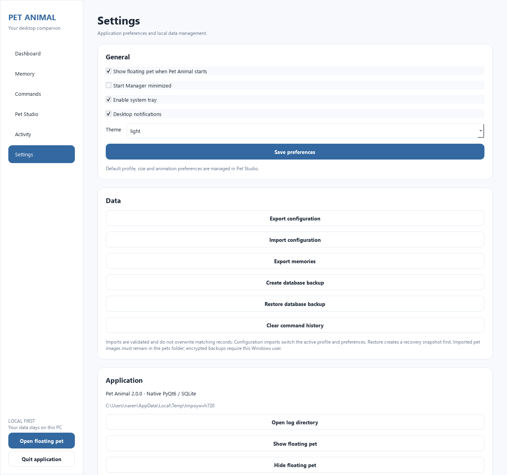
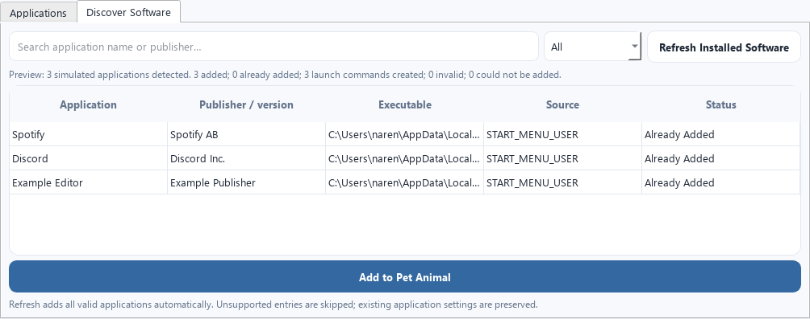

# Pet Animal 2.0

A local-first Windows desktop companion with optional online speech recognition featuring a transparent floating Husky pet, an interactive command bar with `@` application autocomplete and `/` local file search, bundled multilingual speech recognition (English + Tamil + Tanglish), persistent personal memory with Windows DPAPI encryption, software discovery, and a full-featured 6-page native Manager window.

Pet Animal 2.0 runs natively on Windows with Python and PyQt6. Both windows share a single headless application core and local SQLite database. Storage and local speech engines operate offline. The default Google speech option sends recorded audio to Google over HTTPS; select Whisper for offline voice recognition. No cloud telemetry is collected.

---

## Table of Contents

- [Overview & Architecture](#overview--architecture)
- [Quick Start](#quick-start)
  - [Prerequisites](#prerequisites)
  - [Local Installation](#local-installation)
  - [Running the Companion](#running-the-companion)
  - [Offline Voice Model Setup](#offline-voice-model-setup)
- [Floating Desktop Companion](#floating-desktop-companion)
  - [Interactive Sprite & States](#interactive-sprite--states)
  - [Desktop Anchoring & Movement](#desktop-anchoring--movement)
  - [Minimize & Restore](#minimize--restore)
  - [Response Speech Balloon](#response-speech-balloon)
  - [System Tray & Safe Exit](#system-tray--safe-exit)
- [Command Bar & `@` Shortcut Autocomplete](#command-bar---shortcut-autocomplete)
- [Offline Multilingual Voice Recognition](#offline-multilingual-voice-recognition)
  - [Supported Languages & Code-Mixing](#supported-languages--code-mixing)
  - [Waveform & Voice Bar Controls](#waveform--voice-bar-controls)
  - [Privacy & Silence Detection](#privacy--silence-detection)
- [Native Manager Window](#native-manager-window)
  - [1. Dashboard](#1-dashboard)
  - [2. Memory Engine](#2-memory-engine)
  - [3. Commands & Intent Manager](#3-commands--intent-manager)
  - [4. Pet Studio](#4-pet-studio)
  - [5. Activity Audit Log](#5-activity-audit-log)
  - [6. Settings](#6-settings)
- [Software Discovery & One-Click Refresh](#software-discovery--one-click-refresh)
- [Smart Command Pipeline](#smart-command-pipeline)
  - [Execution Flow](#execution-flow)
  - [Negation Veto](#negation-veto)
  - [Reserved Memory & Help Phrases](#reserved-memory--help-phrases)
  - [Confidence Gating & Clarification](#confidence-gating--clarification)
  - [Web Search & YouTube Playback](#web-search--youtube-playback)
- [Local File & Folder Search](#local-file--folder-search)
  - [Command Grammar & Query Syntax](#command-grammar--query-syntax)
  - [Interactive Balloon & Keyboard Navigation](#interactive-balloon--keyboard-navigation)
  - [Smart Ranking & Recency Modes](#smart-ranking--recency-modes)
  - [Dual-Backend Engine & Everything Integration](#dual-backend-engine--everything-integration)
  - [Scope Configuration & Manager Settings](#scope-configuration--manager-settings)
  - [Security Invariants & Privacy Protections](#security-invariants--privacy-protections)
- [Storage, Privacy & Security Invariants](#storage-privacy--security-invariants)
  - [Local Storage Layout](#local-storage-layout)
  - [Windows DPAPI Encryption](#windows-dpapi-encryption)
  - [History & Logging Privacy](#history--logging-privacy)
  - [Safe Database Backup & Restore](#safe-database-backup--restore)
  - [Zero Shell Execution Guarantee](#zero-shell-execution-guarantee)
- [Development, Testing & Verification](#development-testing--verification)
  - [Automated Test Suite (866 Tests)](#automated-test-suite-866-tests)
  - [Headless Diagnostic Self-Test](#headless-diagnostic-self-test)
  - [Packaging the Windows Release & Installer](#packaging-the-windows-release--installer)
  - [Release Artifact Verification](#release-artifact-verification)

---

## Overview & Architecture

Pet Animal 2.0 enforces a strict two-tier architecture separating the domain logic from presentation widgets:

```text
┌────────────────────────────────────────────────────────────────────────┐
│                          Presentation Tier                             │
│   ┌───────────────────────────────┐  ┌─────────────────────────────┐   │
│   │         ManagerWindow         │  │          PetWindow          │   │
│   │    (6 Administration Tabs)    │  │  (Floating Transparent Pet) │   │
│   └───────────────┬───────────────┘  └──────────────┬──────────────┘   │
└───────────────────┼─────────────────────────────────┼──────────────────┘
                    │                                 │
┌───────────────────▼─────────────────────────────────▼──────────────────┐
│                         ApplicationController                          │
│   - Window lifecycle, visibility, tray icon, & minimization            │
│   - Real-time appearance synchronization & position persistence        │
│   - Asynchronous worker coordination (voice, browser, discovery)       │
│   - Application shortcut (@) autocomplete popover coordination         │
└───────────────────────────────────┬────────────────────────────────────┘
                                    │
┌───────────────────────────────────▼────────────────────────────────────┐
│                    ApplicationCore (Headless Domain)                   │
│   - Pure Python & SQLite 3 (Zero GUI / Qt / HTTP dependencies)         │
│   - Personal Memory Engine (Typed records, retrieval, DPAPI masking)   │
│   - Smart Command Interpreter & Intent Resolver                        │
│   - Software Discovery & Registration Service                          │
│   - Pet profile validation & appearance settings                       │
│   - SQLite backup, restore & cryptographic validation                  │
└─────────────────┬──────────────────────────────────┬───────────────────┘
                  │                                  │
┌─────────────────▼─────────────┐    ┌───────────────▼──────────────┐
│        SQLite Database        │    │        WindowsLauncher       │
│  - WAL mode, foreign keys     │    │  - Strict allowlist dispatch │
│  - Migrations (v1 to v5)      │    │  - No shell=True execution   │
│  - DPAPI ciphertext storage   │    │  - HTTPS URL validation      │
└───────────────────────────────┘    └──────────────────────────────┘
```

- **Headless Domain (`src/core/application.py`)**: Central domain controller containing pure Python business logic, SQLite query routines, schema migrations, and listener callbacks.
- **Application Controller (`src/app/controller.py`)**: Coordinates window lifecycles, manages desktop positioning, synchronizes theme/appearance mutations, and routes commands.
- **Presentation Windows (`src/app/`)**: `PetWindow` (the desktop companion) and `ManagerWindow` (the management studio).
- **Execution Services (`src/services/`)**: `WindowsLauncher` for allowlisted application and URL dispatch, `VoiceInputWorker` for local or optional Google speech transcription, and `SoftwareDiscoveryService` for Start Menu and registry scanning.

---

## Quick Start

### Prerequisites
- **Operating System**: Windows 10 or Windows 11 (64-bit).
- **Python**: Python 3.10 to Python 3.14.
- **Microphone**: Any standard audio input device for voice recognition.

### Local Installation
Clone the repository and set up a virtual environment:

```powershell
# Clone the repository
git clone https://github.com/Raja-Narendran/pet_animal.git
cd pet_animal

# Create and activate virtual environment
python -m venv .venv
.venv\Scripts\activate

# Install required dependencies
pip install -r requirements.txt
```

### Running the Companion
Launch the application:

```powershell
.venv\Scripts\python.exe src/main.py
```

- If `launch_pet` is `True` in settings, the transparent floating Husky companion appears on your desktop.
- If `start_minimized` is `False` or the system tray is hidden, the native **Manager Window** opens automatically.
- Logs are written to `%LOCALAPPDATA%\PetAnimal\logs\pet_animal.log`.

### Offline Voice Model Setup
Pet Animal bundles models in release packages. For local development on a fresh checkout, run the model preparation scripts once:

```powershell
# Download faster-whisper small multilingual model (~486 MB for Tamil + English)
.venv\Scripts\python.exe release/prepare_multilingual_voice.py
```

> [!NOTE]
> Downloads occur strictly during setup and build. At runtime, the models run 100% offline on your CPU with zero internet connectivity.

---

## Floating Desktop Companion

The companion window (`PetWindow`) provides an interactive desktop presence:



### Interactive Sprite & States
The Husky companion features animated pixel-art sprites rendered using transparent frames (`WA_TranslucentBackground`):
- **Idle**: Gentle breathing/blinking idle animation.
- **Greeting**: Interactive tail-wagging greeting triggered whenever you click the pet.
- **Thinking**: Displayed while listening to microphone input or parsing a command.
- **Working**: Animated during background command execution, search, or YouTube resolution.
- **Sleeping**: Calming sleep state accessible via right-click context menu.
- **Success**: Cheerful reaction upon successful command execution.
- **Error**: Expressive error animation if a command fails or is rejected.

### Desktop Anchoring & Movement
- **Draggable Positioning**: Click and drag the pet anywhere on your multi-monitor desktop.
- **Persistent Coordinates**: Screen coordinates are automatically saved to `%LOCALAPPDATA%\PetAnimal\state.json` and synced to the active pet profile.
- **Screen Boundary Clamping**: The window automatically detects monitor bounds and keeps controls accessible above the taskbar.
- **Anchor Invariant**: Opening the command box, displaying response balloons, or switching states maintains the pet's screen position without shifting or jumping.

### Minimize & Restore
- **Minimize Pet (`−`)**: Clicking the minimize button in the control bar collapses the pet companion while keeping the compact command chat box on screen.
- **Expand Pet (`▲`)**: Clicking the expand arrow on the chat box smoothly restores the pet companion and control bar.

### Response Speech Balloon
The response bubble (`ResponseBubbleWidget`) is a standalone floating window that appears directly above the companion:
- Displays command confirmations, query answers, and status messages.
- Custom-painted antialiased rounded background and soft shadow (eliminating Qt translucent window ghosting).
- Auto-hides after a configurable timeout (default: 3 seconds for results, 4 seconds for errors).
- Doubles as the interactive `@` shortcut suggestion popover.

### System Tray & Safe Exit
- **System Tray Icon**: Lives in the Windows notification area with a context menu (`Show Floating Pet`, `Open Manager`, `Hide Floating Pet`, `Settings`, `Quit`). Double-clicking opens the Manager.
- **Lockout Prevention**: If you hide the pet companion while the system tray icon is disabled in Settings, the Manager automatically opens so you are never locked out of the application.
- **Closing the Pet (`×`)**: Hides the companion. If tray notifications are enabled, a balloon confirms the pet is resting.
- **Exit Pet Animal**: Gracefully shuts down background workers, stops animations, saves coordinates, and terminates the Qt event loop.

---

## Command Bar & `@` Shortcut Autocomplete

The command input bar (`CommandBoxWidget`) provides semi-transparent glass styling with custom-rendered rounded corners and subtle drop shadows:

- **Direct Command Input**: Type any command phrase and press <kbd>Enter</kbd> or click <kbd>➤</kbd>.
- **`@` Shortcut Autocomplete**:
  - Type `@` to instantly open a floating suggestion balloon above the companion showing all enabled registered applications.
  - Continue typing (e.g. `@ch`, `@spot`, `@code`) to filter suggestions in real time.
  - Navigate suggestions using the <kbd>↑</kbd> and <kbd>↓</kbd> arrow keys.
  - Press <kbd>Enter</kbd>, click <kbd>➤</kbd>, or click an item directly to launch the application.
  - Press <kbd>Esc</kbd> to dismiss suggestions.
  - Works seamlessly in both full companion mode and minimized chat-only mode.
  - **Live Authorization**: Suggestion entries use stable IDs (`app-<uuid>`) and revalidate the executable path on every launch; typing alone never executes arbitrary code.

---

## Offline Multilingual Voice Recognition

Clicking the microphone icon (`🎤`) transforms the text input into an audio-driven speech bar.

### Supported Languages & Code-Mixing
Pet Animal uses a pinned [faster-whisper small](https://huggingface.co/Systran/faster-whisper-small) model running on CPU with 8-bit quantization (`int8`):
- **English**: `open Chrome`, `launch Calculator`, `search Google for Python tutorials`, `play Shape of You on YouTube`.
- **Tamil**: `குரோம் ஓபன் பண்ணுங்க`, `சென்னை வானிலை தேடு`, `வாத்தி கம்மிங் பாட்டு போடு`.
- **Tanglish (Code-Mixed Tamil + English)**:
  - `Chrome open பண்ணு` or `Chrome ah open pannu` → opens Google Chrome.
  - `Shape of You பாட்டு play பண்ணு` or `Shape of You paattu play pannu` → plays Shape of You on YouTube.
  - `vs code start பண்ணு` → opens Visual Studio Code.
  - `சென்னை weather search பண்ணு` → searches Chennai weather.

### Waveform & Voice Bar Controls
- **Audio Waveform (`AudioWaveform`)**: Renders real-time animated waveform bars responsive to live microphone PCM amplitude.
- **Status Indicators**: Displays progressive state transitions: `Starting…` → `Listening…` → `Recognizing…`.
- **Dedicated Cancel Button (`×`)**: Immediately halts audio recording, frees workers, and restores text input without executing.
- **Correction Preservation**: If a spoken command fails or is unrecognized, the transcribed text is retained in the text input box so you can edit and submit it manually without speaking again.

### Privacy & Silence Detection
- **Local Audio Processing**: Audio is processed entirely in RAM and immediately discarded after recognition; zero bytes are uploaded or saved to disk.
- **WebRTC VAD Silence Detection**: Automatically detects when you stop speaking (1.5 seconds of trailing silence) to trigger recognition.
- **Safety Cutoff**: A 60-second phrase limit automatically discards incomplete recordings rather than executing unintended commands.

---

## Native Manager Window

The Manager Window (`ManagerWindow`) provides a native desktop interface with seven specialized administration pages built with Figma-inspired design tokens:



### 1. Dashboard
- **Live Metrics**: Real-time counters showing total saved memories, registered commands, and executions today.
- **Active Pet Profile**: Displays active pet name, dimensions, sprite preview, and status.
- **Quick Action Buttons**: Instant access to Add Memory, New Command, Customize Pet, Backup Database, and Open Floating Pet.
- **Recent Activity Audit Feed**: Chronological log of recent executions with timestamps and success/failure indicators.
- **Category Progress Bars**: Visual breakdown of stored memories by category.

---

### 2. Memory Engine



Manage persistent structured memories with Windows DPAPI encryption:
- **Record Types**: `PROFILE`, `PREFERENCE`, `KNOWLEDGE`, `HABIT`, `RELATIONSHIP`, `NOTE`, `CONTEXT`, and `SYSTEM`.
- **Record Scopes**:
  - `GLOBAL`: Available system-wide.
  - `PROFILE`: Bound to the current user profile.
  - `PET_PROFILE`: Bound to the active pet companion profile.
  - `SESSION`: Ephemeral records cleared automatically on application restart or shutdown.
  - `TEMPORARY`: Time-limited records that expire after a specified duration.
- **Simplified Categories**:
  - `Personal Information` (Unencrypted structured data: Name, Address, IDs, Mobile, Email).
  - `Password` (Sensitive: encrypted via Windows DPAPI).
  - `Credit and Debit card details` (Sensitive: encrypted via Windows DPAPI).
  - `Important Notes` (General notes and project context).
- **Add Memory Dialog**:
  - Pre-filled personal title selectors: **Name**, **Address**, **IDs** (with dynamic ID title input, e.g. Passport, License), **Mobile number**, **Email ID**, or **Custom**.
  - Password category automatically prompts for **Website or app name** and generates standard keys (`<app>.password`).
- **DPAPI Protection**:
  - Sensitive categories store base64-encoded Windows DPAPI ciphertexts (`dpapi:<base64>`).
  - Values are masked as `••••••••` in tables, search results, and logs.
  - Click **Reveal encrypted value** to temporarily decrypt and view records locally.
- **Tags, Aliases & Relationships**:
  - Add search tags and multiple trigger aliases (e.g. `user.name` aliased to `my name`, `user name`).
  - Create directed graph relationships between memories (e.g., `preferred.editor` *used_for* `project.pet_animal.path`).
- **Lifecycle & Maintenance**:
  - **Clean Expired Memories**: Filters and purges expired temporary memories with user confirmation.
  - **Safe Export**: Exports non-sensitive memories and relationships to JSON (sensitive records are strictly excluded).
  - **Import Memories**: Validates JSON memory payloads with full duplicate and conflict preview before committing.
  - **Full Encrypted Backup**: Creates a complete SQLite database backup preserving DPAPI ciphertexts.

---

#### Fetch memories from the pet

| Request | Balloon interaction |
| :--- | :--- |
| `my google password` or `show me my office password` | Shows a partial mask such as `123****098` and a copy button for the full password. |
| `list my passwords` | Lists saved names with individual password copy buttons. Click a name for a masked preview. |
| `list my card details` | Lists card names. Click a card for separate card number, CVV and expiry copy buttons. |
| `my SBI debit card number` or `CVV of my SBI debit card` | Shows the requested field and its copy button. |

Matching uses the names, keys and aliases saved in Memory. Duplicate names offer choices. Disabled, expired and other-profile records are unavailable. Lists do not decrypt secrets; a named request or a row click provides a masked preview, and clicking copy decrypts only that record to place the full value on the clipboard. The balloon never displays the full password, card number or CVV.

Use **Back** to return to the list and **×** or **Esc** to dismiss. Choices expire after two minutes and are cleared when another command replaces them or the pet is hidden. Clipboard content remains available for pasting. Memory requests and values are excluded from command history and logs. Existing encrypted Memory entries work without re-entering them.

### 3. Commands & Intent Manager



Configure, audit, and test application and URL commands:
- **Command Registry**: Table listing command name, action type (`application` or `url`), target ID/URL, configured phrases (1–30 phrases per command), and enabled status.
- **Actions**: Add new commands, edit existing commands, delete custom commands, toggle enabled/disabled, and run **Test selected**.
- **Smart Command Tester ("Test Understanding")**:
  - Tests how Pet Animal understands a typed or spoken phrase without executing it or recording history.
  - Reports matched intent type, action type, target ID, resolved registered phrase, confidence score, match reason, and negation status.
- **Software Discovery Panel**: Access the background discovery scanner and application alias manager (detailed below).

---

### 4. Pet Studio



Customize your desktop companion's appearance and behavior:
- **Builtin Sprite Sheets**: Select from builtin Husky states (`idle`, `greeting`, `thinking`, `working`, `sleeping`, `success`, `error`).
- **Import Custom Sprite Sheets**: Import your own PNG sprite sheets (validates $\le 8\text{ MB}$, square frames from 16px to 512px height, horizontal strip of 1–64 frames).
- **Profile Management**: Create, edit, switch, and delete pet profiles (enforces exactly one active profile).
- **Live Appearance Sliders**:
  - **Companion Size**: 96 px to 400 px.
  - **Chat Bubble Width**: 260 px to 600 px.
  - **Input Text Font Size**: 10 px to 24 px.
  - **Corner Radius**: 0 px to 30 px.
  - **Glass Background Opacity**: 20% to 100%.
  - **Background Color**: Hex color code picker.
  - **Toggles**: Always on Top, Enable Animations.
- **Interactive Live Preview**: Real-time mockup showing the sprite animation and chat box styling before saving.

---

### 5. Activity Audit Log



A comprehensive, privacy-preserving audit log of all command executions:
- **Columns**: Timestamp, Command Name, Trigger Phrase, Execution Status (`success` / `failed`), Error Details.
- **Filtering**: Filter by execution status (`All`, `Success`, `Failed`), command selection, or specific local calendar date.
- **Clear History**: Purges all execution history with user confirmation.
- **Privacy Protections**: Unsupported inputs are logged strictly as `[unsupported command]`. Direct website addresses are logged only as `[website open]`. Free-form search queries and song titles are logged only as `[web search]` or `[music playback]`. Password contents and memory values never enter execution history.

---

### 6. Settings



Application preferences and database maintenance:
- **Appearance**: Toggle between **Light Theme** and **Dark Theme**.
- **Startup & Windows Behavior**:
  - `Launch floating pet on startup`: Automatically shows the pet companion on boot.
  - `Start minimized to system tray`: Launches directly to tray without opening the Manager.
  - `Show system tray icon`: Toggles system tray integration.
  - `Enable desktop notifications`: Enables balloon notifications for background events.
- **Voice Recognition Mode**:
  - `Google Web Speech (Online)`: Default for new settings; English (India) or Tamil (India). Sends recorded audio to Google and requires internet.
  - `Multi-language (Tamil / English Whisper)`: Bundled neural model for English, Tamil, and Tanglish.
- **Voice Activation Shortcut**: Enable `Ctrl + Windows` in Settings and click **Save preferences**. Hold both keys to speak from any application; release either key to recognize and submit through the existing voice command flow. The pet appears automatically. The shortcut is disabled by default, supports either left/right key, and works only while Pet Animal is running. Wait for the Listening indicator before speaking while a local model warms up. The microphone button keeps its usual automatic silence detection.
- **Local File Search**:
  - `Search Folders`: Configure custom directory roots (one per line, up to 32 paths) to restrict filesystem searches to chosen folders and workspace trees.
  - `Everything CLI (es.exe)`: Configure custom path to Voidtools Everything command-line executable (`es.exe`) or rely on automatic detection.
- **Storage & Diagnostics**:
  - **Open Logs Folder**: Opens `%LOCALAPPDATA%\PetAnimal\logs` in File Explorer.
  - **Export Configuration**: Saves settings, commands, profiles, and registered applications to JSON.
  - **Import Configuration**: Validates and imports configuration JSON.
  - **Create Database Backup**: Creates an instantaneous SQLite backup snapshot in `%LOCALAPPDATA%\PetAnimal\backups\`.
  - **Restore Database**: Validates SQLite integrity, foreign keys, schema matching, asset existence, and DPAPI decryption before restoring.
- **Quit Pet Animal**: Explicit application exit button.

---

## Software Discovery & One-Click Refresh



The Software Discovery engine automatically finds installed Windows applications without manual path entry:

- **Discovery Providers**:
  - **User & System Start Menus**: Scans `.lnk` shortcuts from `%APPDATA%\Microsoft\Windows\Start Menu` and `%PROGRAMDATA%\Microsoft\Windows\Start Menu`.
  - **Windows Uninstall Registry**: Scans 32-bit and 64-bit registry keys (`HKCU` and `HKLM\Software\Microsoft\Windows\CurrentVersion\Uninstall`).
  - **System PATH**: Resolves known common executables on `PATH`.
- **One-Click "Refresh Installed Software"**:
  - Click **Refresh Installed Software** in **Commands → Discover Software** to scan all providers in a non-blocking background worker.
  - Automatically filters out uninstallers, updaters, helper binaries, scripts (`.bat`, `.cmd`, `.ps1`), and administrative tools.
  - Automatically registers all valid launchable applications with standard `open <app>`, `launch <app>`, and `start <app>` command phrases.
  - Generates unique aliases for duplicate names (e.g. `spotify app`, `spotify app 2`).
  - Skips already-registered software and preserves disabled commands.
  - Displays a summary dialog with counts of added, already existing, invalid, and failed applications.
- **Candidate Filtering**: Filter candidate lists by **All**, **Launchable**, **Already Added**, **Review Needed**, or **Invalid**.
- **Manual Registration**: Individual **Add to Pet Animal** dialog allows customizing the application display name, trigger aliases, and command phrases.
- **Application Management**:
  - View registered applications, their executable paths, discovery sources, and repair status.
  - Toggle enabled/disabled.
  - Edit application trigger aliases.
  - Unregistering disables associated command phrases while keeping installed files intact.
- **Repair Status**: If a registered executable is moved or deleted, the application is marked as **Needs repair** and disabled to prevent unsafe launches.

---

## Smart Command Pipeline

### Execution Flow

Every command (typed, transcribed, or submitted via `@` shortcut) passes through a multi-tier deterministic pipeline:

```text
User Input (Typed or Spoken)
  │
  ├─► [1] Input Validation (≤ 500 chars, no control characters)
  │
  ├─► [2] File Search Slash Shortcut & Cancel (/query, "no", "cancel")
  │
  ├─► [3] Mandatory Negation Veto (e.g. "don't open chrome" ➔ CANCELLED)
  │
  ├─► [4] '@' Application Shortcut (Direct lookup of registered application)
  │
  ├─► [5] Reserved Phrases Check (help, name storage, memory commands)
  │
  ├─► [6] Natural Language File/Folder Search (e.g. "find report.xlsx", "search folders for pet")
  │
  ├─► [7] Exact Registered Phrase Match (SQLite registered command phrases win)
  │
  ├─► [8] Multilingual / Tanglish Voice Normalization
  │
  ├─► [9] Rule-Based Intent Interpretation (Verbs: open, launch, search, play)
  │
  ├─► [10] Live Intent Resolver (Matches enabled commands & aliases)
  │
  ├─► [11] Confidence Gate (≥ 0.85 auto-executes; < 0.85 prompts clarification)
  │
  └─► [12] Safe Launcher Execution (Validated WindowsLauncher or Background Worker)
```

### Plain Text Search and Website Addresses

Existing commands, memory requests, local file searches, and workflow phrases take precedence.
Otherwise, plain text searches Google in the default browser, preserving the original query.

| Input | Action |
| :--- | :--- |
| `weather tomorrow` | Search Google |
| `amazon.com` | Open `https://amazon.com` |
| `amazon.co.uk` | Open `https://amazon.co.uk` |
| `amazon.com reviews` | Search Google |
| `search amazon.com` | Search Google |
| `https://docs.python.org/3/` | Open the HTTPS address |

Direct opening requires the entire input to be a valid domain or HTTPS address.
Subdomains and internationalized domain names are supported. Explicit unsupported or
incomplete commands retain their error behavior. Google searches still require the
Google command to be enabled. HTTPS addresses cannot contain credentials, whitespace,
control characters, or nonstandard ports.

Domain recognition uses the bundled IANA snapshot at
`assets/domains/tlds-alpha-by-domain.txt`, obtained from
[the IANA TLD list](https://data.iana.org/TLD/tlds-alpha-by-domain.txt).
Refresh this file during maintenance; the app never downloads domain data or performs
DNS checks to classify input. Search queries and direct addresses are excluded from
persistent history and logs; direct openings appear as `[website open]` in Activity.

### Negation Veto
Pet Animal enforces a mandatory safety veto: any command containing negation words (e.g., `do not`, `don't`, `never`, `vendam`, `koodadhu`) is immediately halted with:
> *"Command cancelled. Nothing was executed."*

The negation veto takes precedence over everything, including exact registered custom phrases.

### Reserved Memory & Help Phrases

The following deterministic patterns are reserved:

| Pattern | Action |
| :--- | :--- |
| `help` / `show help` / `commands` / `?` | Displays supported commands and usage syntax. |
| `remember my name as <value>` | Proposes saving your name; displays Yes/No confirmation dialog. |
| `save my name as <value>` | Proposes saving your name with Yes/No confirmation. |
| `my name is <value>, remember that` | Proposes saving your name with Yes/No confirmation. |
| `what is my name` / `do you remember my name` | Retrieves and displays your saved name. |
| `remember <key> as <value>` | Proposes saving a memory record with Yes/No confirmation. |
| `save <key> as <value>` | Proposes saving a memory record with Yes/No confirmation. |
| `remember that <key> is <value>` | Proposes saving a memory record with Yes/No confirmation. |
| `remember note: <text>` | Saves an important note record with Yes/No confirmation. |
| `what is <key>` / `what's <key>` / `recall <key>` | Queries and displays the requested structured memory record. |
| `what browser do i prefer` | Queries your saved `preferred.browser` preference. |
| `open my browser` | Resolves `preferred.browser` and launches the preferred application. |
| `open my editor` | Resolves `preferred.editor` and launches your preferred code editor. |
| `forget <key>` / `delete memory <key>` | Displays Yes/No confirmation to delete the specified memory record. |

> [!IMPORTANT]
> Memory proposals expire after 5 minutes if unconfirmed. Confirmed memory commands and their values never enter command history.

### Confidence Gating & Clarification
- Matches with confidence $\ge 0.85$ execute automatically.
- Matches with ambiguous targets (multiple matching enabled commands) or confidence below $0.85$ prompt for clarification (e.g. `open code` returns *"Did you mean 'Open VS Code'?"*).
- Unknown commands return *"Unsupported command. Type help to see registered phrases."*

### Web Search & YouTube Playback
- **Web Search**: `search Google for <query>`, `search for <query>`, `look up <query>`.
  - Opens Google Search in your default browser.
  - Requires an enabled registered `google` URL command.
  - Runs in a background worker (`BrowserWorker`) to prevent UI freezing.
- **YouTube Music Playback**: `play <song> on youtube`, `play song <song>`, `<song> பாட்டு play பண்ணு`.
  - Searches and plays the requested video on YouTube.
  - Requires an enabled registered `youtube` URL command.
  - Runs in an asynchronous worker (`YouTubePlayWorker`).
  - Free-form search queries and song titles are masked in command history as `[web search]` and `[music playback]`.

---

## Local File & Folder Search

Pet Animal 2.0 provides an offline, privacy-preserving desktop search engine for local files and directories. Query files or folders directly from the floating companion's command box or offline voice input, review results in a dedicated interactive balloon with mouse and keyboard navigation, and open documents directly in their default Windows applications.

### Command Grammar & Query Syntax

File search supports fast slash shortcuts, natural language expressions, and multi-turn conversational follow-ups:

| Input Phrase | Behavior |
| :--- | :--- |
| `/report.xlsx` or `Find report.xlsx` | Shows matching files in the interactive balloon. |
| `/pet folder` or `Find pet folder` | Searches specifically for matching folders and displays them in Explorer upon launch. |
| `Search files for notes` / `Locate budget.csv` | Natural language file search equivalent to slash syntax. |
| `Search folders for source` / `Find folder src` | Explicit folder search across local directories. |
| `Find my package.xml` | Offers a unique Salesforce project match when one is uniquely identifiable. |
| `Yes` | Confirms and opens an offered Salesforce or unique project match. |
| `Open it` | Opens the currently highlighted or unique result in its default Windows application. |
| `Show results`, `Next results`, `Previous results` | Paginates through retained results (5 rows per page). |
| `Open 2` or `Open result 3` | Launches a specific numbered result from the list. |
| `the Salesforce one` | Resolves and opens a uniquely named project folder match. |
| `Open the most recent one` / `Open the latest one` | Selects and opens the match with the newest filesystem modification date. |
| `No` or `Cancel` | Clears active search selection and dismisses the balloon. |

- **Slash Shortcut (`/`)**: Searches files by default. Adding `folder` (e.g. `/pet folder`) searches directories.
- **Literal Names & Quotes**: Names can contain spaces and Unicode characters (e.g. `/சென்னை.txt`, `/my report.xlsx`). Wrapping names in quotes (e.g. `/"my folder"`, `/"don't stop.txt"`) preserves literal punctuation and prevents collision with negation or grammar rules.
- **Extension Inference**: File extensions are inferred automatically (e.g. `/report.pdf` or `find package.xml` infers `.pdf` and `.xml` extension filters).
- **Separation of Parsing and I/O**: Parsing is completely decoupled from filesystem access. The interpreter generates a structured `CommandIntent` (`IntentType.FILE_SEARCH`) without touching disk:

```json
{
  "intent": "FILE_SEARCH",
  "query": "PREPRODRELEASE.yml",
  "filters": {"extension": ".yml"},
  "action": "FIND"
}
```

- **Conversational Context**: Follow-up commands (`open it`, `yes`, `open 2`, `the <project> one`, `open the latest one`) resolve against the active `FileSearchSession` without re-running disk scans.

### Interactive Balloon & Keyboard Navigation

Results appear in an interactive floating balloon positioned directly above the companion:

- **Rich Visual List**: Displays up to 5 visible result rows with a native scrollbar. Each item displays a distinct file or folder icon, item name, containing parent directory, and date badge.
- **Full Path Tooltips**: Hovering over any result reveals its complete absolute path.
- **One-Click Mouse Opening**: Click any result row once to immediately open it in its default Windows registered handler or File Explorer.
- **Keyboard Navigation**:
  - <kbd>↑</kbd> and <kbd>↓</kbd> arrow keys in the command input box highlight previous/next results.
  - <kbd>Enter</kbd> (when input box is empty) immediately opens the highlighted result.
  - <kbd>Esc</kbd> or clicking the close button (`×`) dismisses the search balloon.
- **Persistent Session State**: Search results remain interactive after opening an item, allowing you to launch multiple related files from the same search session without repeating the query.
- **Automatic Expiry**: Sessions expire after 5 minutes of inactivity, or upon executing an unrelated command, initiating a new search, or closing the companion.

### Smart Ranking & Recency Modes

The balloon header provides interactive sorting controls to rearrange retained results instantly in memory:

- **Recently opened (Default)**: Combines Windows Recent Items metadata (inspected via native COM `IShellLink::GetPath` without executing shortcuts) with Pet Animal's persistent open history (`file_open_history` table). Items opened recently appear first with an "opened" badge; unrecorded items follow, sorted by modification date with a "No recent-open record" label.
- **Recently changed**: Sorts results strictly by filesystem modification timestamp (`mtime` descending).
- **Instant Re-Sorting**: Toggling between sort modes rearranges existing results in memory without issuing new disk scans.

### Dual-Backend Engine & Everything Integration

Pet Animal incorporates a hybrid search engine combining instant index lookups with a robust offline disk traversal fallback:

1. **Voidtools Everything Integration (`es.exe`)**:
   - Primary high-speed engine when available.
   - Communicates with Voidtools Everything's local service via the official `es.exe` command-line client over local IPC.
   - Searches entire NTFS volumes in milliseconds with zero network overhead.
   - Constructed with safe argument lists, escaped regex filters, and temporary UTF-8 CSV exports that are immediately deleted upon reading.
   - Auto-detected at `%LOCALAPPDATA%\PetAnimal\integrations\everything\es.exe`, system `PATH`, or standard install paths (`C:\Program Files\Everything`).
   - Seamlessly falls back to local disk traversal if Everything is stopped, uninstalled, or times out.

2. **Bounded Offline Disk Traversal (Built-in Fallback)**:
   - 100% offline, zero-dependency recursive directory walker that runs out-of-the-box.
   - Prioritized search roots: User libraries (`Documents`, `Desktop`, `Downloads`, `Projects`), current working directory, and user home directory, followed by fixed local drives (`C:\`, `D:\`).
   - Safety boundaries: Hard limit of 5.0 seconds and 100,000 scanned entries; caps retained results at 200 matches.
   - Smart Exclusion Filters: Skips system and cache directories (`Windows`, `AppData`, `Program Files`, `node_modules`, `.git`, `.venv`, `$Recycle.Bin`, etc.), directory junctions/symlinks, and offline cloud placeholders (OneDrive, iCloud).
   - Incomplete Search Indicators: Clearly flags when traversal limits are reached so you know results are partial, and safely disables automatic single-match launches on partial sets.

### Scope Configuration & Manager Settings

Configure search boundaries and binary paths in **Manager Window → Settings → Local file search**:

- **Custom Search Folders**: Enter explicit directories (one per line, up to 32 roots), such as `D:\Projects` or `K:\pet_animal`. Limiting scope restricts searches strictly to your active development and document trees.
- **Everything Executable Path**: Specify an explicit path to `es.exe` if not located on standard paths.
- **Persistence**: Scope preferences survive database backup/restore and JSON configuration export/import.

### Security Invariants & Privacy Protections

Local file search adheres strictly to Pet Animal's offline security and privacy invariants:

- **Document-Only Launching**: Files are launched exclusively through `os.startfile(path, 'open')` using registered Windows associations. Folders are opened in File Explorer.
- **Strict Executable & Script Blacklist**: Strictly rejects over 30 dangerous binary and script extensions (`.exe`, `.bat`, `.cmd`, `.ps1`, `.vbs`, `.js`, `.wsf`, `.msc`, `.lnk`, `.url`, `.com`, `.scr`, `.hta`, `.reg`, etc.). Arbitrary executables cannot be invoked via file search; use registered application commands or Software Discovery for programs.
- **Local Paths Only**: Rejects UNC network shares (`\\server\share`), mapped network drives, and device namespaces.
- **Zero Command History Logging**: Search queries, partial phrases, and unselected file paths are never written to the `commands` audit log table or application logs.
- **Bounded Open History**: Successful launches record only the normalized destination path and timestamp in `file_open_history` (SQLite schema version 6), bounded to 2,000 entries with automatic LRU pruning.

---

## Storage, Privacy & Security Invariants

### Local Storage Layout
All runtime data is stored locally in `%LOCALAPPDATA%\PetAnimal`:

```text
%LOCALAPPDATA%\PetAnimal\
├── database\
│   └── petanimal.db         # Primary SQLite 3 database (WAL mode, foreign keys, user_version 7)
├── pets\
│   └── imported\            # User-imported PNG sprite sheets (<uuid>.png)
├── backups\                 # Online SQLite backup snapshots (petanimal-YYYYMMDD-HHMMSS-*.db)
├── logs\
│   └── pet_animal.log       # Rotating operational log file
└── state.json               # Window coordinates and UI visibility cache
```

### Windows DPAPI Encryption
- Sensitive categories (`Password`, `Credit and Debit card details`) encrypt values using Windows Data Protection API (`crypt32.dll` via `ctypes`).
- Ciphertexts are stored as `dpapi:<base64-string>`. No encryption keys are stored on disk.
- Encryption is cryptographically bound to the active Windows user account security identifier (SID).
- Sensitive values are masked (`••••••••`) across listings, tables, search results, and logs.
- Plain memory JSON exports completely omit sensitive records.
- Values are decrypted on an explicit Manager reveal, a named pet request or row click for a masked preview, or a pet copy-button click. Password/card lists stay encrypted; plaintext is passed directly to the clipboard only for the requested copy action.

### History & Logging Privacy
- Unsupported inputs are recorded strictly as `[unsupported command]`. Raw invalid inputs are never stored to prevent leaking mistyped credentials.
- Free-form browser queries and song titles are logged only as `[web search]` or `[music playback]`.
- Memory storage and query commands bypass command history entirely.
- File search queries, partial names, and unselected file paths are never written to command history. Successful file opens are stored solely as normalized paths and timestamps in an isolated, bounded table (`file_open_history`, up to 2,000 items).

### Safe Database Backup & Restore
Backups are created using SQLite's online backup API (`db.backup()`). Restoring a database validates:
1. SQLite integrity check (`PRAGMA integrity_check == 'ok'`).
2. Foreign key consistency (`PRAGMA foreign_key_check`).
3. Schema parity (matches runtime tables, constraints, and indexes; prevents SQL injection).
4. Command validation (all actions and application IDs are valid).
5. Active pet profile (exactly one active profile).
6. Sprite asset existence (all referenced PNGs exist on disk).
7. DPAPI decryption test (ensures sensitive records can be decrypted by the current Windows user).
8. Automatic pre-restore recovery snapshot (creates a recovery backup before replacing live data).

### Zero Shell Execution Guarantee
- **No Shell Execution**: The application never invokes `subprocess.Popen(..., shell=True)` or `os.system()`.
- **Argument List Execution**: Applications must be registered in `WindowsLauncher.SUPPORTED_APPS` or validated in `registered_applications` with an absolute path to a local `.exe` file.
- **URL Validation**: Web actions only accept valid `https://` URLs without embedded credentials (`user:pass@`) on standard port 443.
- **File & Folder Launching**: Documents are opened strictly using `os.startfile(path, 'open')` via Windows registered file handlers. Over 30 executable and script file formats (`.exe`, `.bat`, `.cmd`, `.ps1`, `.vbs`, `.js`, `.lnk`, etc.) as well as UNC network paths are strictly prohibited from being opened via file search.

---

## Development, Testing & Verification

### Automated Test Suite (866 Tests)
Pet Animal 2.0 includes a comprehensive test suite covering all modules:

```powershell
# Run the complete test suite
.venv\Scripts\python.exe -m pytest -q
```

**Expected Result**:
```text
866 passed, 1 warning in ~81s
```

Run targeted test modules during focused development:

```powershell
# Core domain & SQLite tests
.venv\Scripts\python.exe -m pytest tests/test_application_core.py -q

# Personal Memory Engine tests
.venv\Scripts\python.exe -m pytest tests/test_memory_engine.py tests/test_memory_commands.py tests/test_memory_ui.py -q

# Smart command interpreter & normalizer
.venv\Scripts\python.exe -m pytest tests/test_smart_commands.py tests/test_command_interpreter.py -q

# Local file and folder search tests
.venv\Scripts\python.exe -m pytest tests/test_file_search.py tests/test_interactive_file_results.py -q

# Software discovery service & UI
.venv\Scripts\python.exe -m pytest tests/test_software_discovery.py tests/test_software_discovery_ui.py -q

# Application shortcuts & autocomplete
.venv\Scripts\python.exe -m pytest tests/test_application_shortcuts.py -q

# Multilingual voice recognition
.venv\Scripts\python.exe -m pytest tests/test_multilingual_voice.py tests/test_voice_bar.py -q

# Windows launcher & security checks
.venv\Scripts\python.exe -m pytest tests/test_windows_launcher.py -q
```

### Headless Diagnostic Self-Test
The application features a built-in offscreen verification mode (`--self-test`) that creates a temporary isolated environment to verify database migrations, memory persistence, backup/restore, software discovery, all seven Manager pages, live profile switching, speech engines, and clean shutdown without displaying GUI windows:

```powershell
.venv\Scripts\python.exe src/main.py --self-test build/source-verification.json
```

Inspect the generated JSON report:

```powershell
Get-Content build/source-verification.json | ConvertFrom-Json
```

Expected result:
```json
{
  "success": true,
  "version": "2.0.0",
  "software_discovery": {
    "candidates": 282,
    "launchable": 71
  },
  "personal_memory_engine": {
    "schema_version": 7,
    "preference_resolution": true,
    "aliases_tags_relationships": true,
    "access_tracking": true,
    "dpapi_safe_export": true,
    "session_restore_cleanup": true
  },
  "checks": [
    "SQLite migration",
    "memory persistence",
    "backup restore",
    "seven Manager pages",
    "live profile switching",
    "independent Manager closing",
    "offline English and Tamil engines, models, native decoder, and voice command routing",
    "smart command resolution, negation and parse-only Manager tester",
    "software discovery, user-authorized bulk refresh registration, duplicate refresh, dynamic Tanglish aliases, disable, missing-path restore and removal",
    "quit cleanup"
  ]
}
```

### Packaging the Windows Release & Installer
The automated packaging pipeline runs pytest, compiles the application via PyInstaller, and bundles it into a standalone Windows installer:

```powershell
.\release\build.ps1
```

This generates:
- `dist/v2/pet-animal/pet-animal.exe` (Packaged standalone desktop application)
- `dist/v2/Pet-Animal-2.0-Setup.exe` (Single-file Windows installer)

**Installer Features**:
- Installs to `%LOCALAPPDATA%\Programs\Pet Animal` without administrator privileges.
- Creates Start Menu shortcuts.
- Registers an uninstaller in Windows Settings ("Installed apps").
- Safely preserves your database, memories, and custom sprite sheets in `%LOCALAPPDATA%\PetAnimal` upon uninstallation.

### Release Artifact Verification
Verify frozen build integrity and installer payload:

```powershell
# 1. Verify frozen standalone executable self-test
Start-Process -Wait -WindowStyle Hidden -FilePath .\dist\v2\pet-animal\pet-animal.exe -ArgumentList '--self-test', 'K:\pet_animal\build\packaged-verification.json'

# 2. Verify installer package CRC and embedded payload
Start-Process -Wait -WindowStyle Hidden -FilePath .\dist\v2\Pet-Animal-2.0-Setup.exe -ArgumentList '--verify-payload', 'K:\pet_animal\build\installer-verification.json'
```

---

## License

Pet Animal 2.0 is licensed under the MIT License. See [LICENSE](LICENSE) for details. Multilingual Whisper components are licensed under the Apache 2.0 License (see [assets/speech/WHISPER-LICENSE.txt](assets/speech/WHISPER-LICENSE.txt)).


## Workflows / Routine Builder

Open **Manager → Workflows** to build an approved routine on a connected linear canvas.
Use **New routine** or the **Start Work template**, give it a name and 1–30 trigger
phrases, then add/reorder steps and configure their settings. Saving approves the
configured targets. Run from the Manager or type an exact saved phrase in the pet.

Supported steps:

- **Open App**: builtin allowlisted apps or enabled approved registered apps.
- **Open URL**: enter a website such as `example.com` or a full `https://` URL. The builder
  adds HTTPS to ordinary website addresses before validating and saving them. URLs open
  in the default browser. Opening Chrome
  as a separate step does not change the default browser.
- **Open Folder**: an existing absolute folder on a local fixed disk; network shares,
  links, and offline placeholders are rejected.
- **Open File**: choose an existing local file (for example a PDF, spreadsheet, image, or
  document). Windows opens it using its default associated app. Executables, scripts,
  shortcuts, network paths, links, and offline placeholders remain blocked.
- **Wait**: 0–90 seconds, without freezing the Manager.
- **Display Message**: 1–100 characters of plain text in the pet bubble and run output.

Routines support 1–50 steps and stop at the first failed step. **Stop** cancels waits
and prevents subsequent actions; applications already opened remain open. Only one
routine runs at a time. Closing the Manager leaves a routine running; quitting cancels
it. A successful Open step means its launch request was accepted, so insert Wait steps
when an external application needs time to load. The final message is preserved;
otherwise the pet says “〈Routine name〉 ready.”

Drag cards or use Move Up/Down to reorder. Save before Run. Save confirmation and validation
errors appear immediately below the Save/Run/Stop controls; failed saves preserve your draft. Unsaved drafts survive
live refreshes and theme changes, with Save/Discard/Cancel when leaving the editor.
Routine commands appear in Commands with **Edit in Workflows**. Activity includes one
entry per run and a **Routine run details** view with individual step outcomes.

Routines and outcomes are stored in SQLite schema version 7 and included in backups.
Configuration imports remap approved application IDs and keep imported routines disabled
for review. Missing targets are flagged. Run history and logs do not store step URLs,
folder paths, message contents, or raw launcher errors. The existing launcher may make
OS/browser launch requests; the workflow engine performs no HTTP calls itself.

Scheduling, branching, loops, nested routines, arbitrary scripts, executable arguments,
and browser automation are outside this release.

### Voice typing into another application

Enable **Ctrl + Windows** in Settings. Click the destination text field, hold Ctrl + Windows, wait for Listening, and say **type how are you question mark**. Release the shortcut and all modifier keys to insert **How are you?**. The pet stays out of focus; insertion never presses Enter or sends a message. This feature uses the keyboard shortcut only.

Speak **question mark**, **exclamation mark**, **comma**, or **full stop** for punctuation. The first letter is capitalized; other text, including Tamil with the multilingual engine, is preserved. Selected text is replaced as normal typing would replace it. Keep the target field focused until insertion finishes. Focus changes cancel typing. Dictation is not saved in command history or logs and does not use the clipboard. Text is limited to 4096 characters; control characters are rejected. Elevated applications and some custom fields may reject Windows Unicode input. Partial insertion is reported and never retried automatically.


### Google Web Speech (Online)

Google is the default voice engine for new settings. In Settings, choose **Google Web Speech (Online)** and select **English (India)** or **Tamil (India)**, then save preferences. Recorded audio is sent to Google over HTTPS and requires internet. Each request uses one selected language; use local Whisper for mixed Tamil/English speech.

The microphone button and Ctrl + Windows hold-to-talk shortcut share the existing waveform, WebRTC VAD, recording limits, and command routing. Google requests time out after 10 seconds and are never retried automatically or used as a fallback from a local engine. Audio remains in memory locally; transcripts and service responses are excluded from diagnostic logs. Local Whisper remains offline and never uploads audio.

SpeechRecognition's standard Google integration uses a shared key intended for personal/testing use, which Google may revoke. No Google Cloud account or API-key setting is added. Recognition after cancellation is discarded; an already submitted request may continue until its timeout.


### Spotify song search

In **Settings**, choose **Default music player → Spotify** and save preferences.
`play shape of you` uses your default player; `play shape of you on spotify`
and `play shape of you on youtube` override it for that request.

**Spotify open using → Auto** opens search results through Windows' installed
Spotify protocol handler (including Microsoft Store installations), falling back
to the default browser if the handler is unavailable or activation fails.
Choose **Browser** to always use Spotify's web search. Select a song and press
Play in Spotify; this integration does not start playback, use the Spotify API,
or store Spotify credentials. Existing installations keep YouTube as default.
