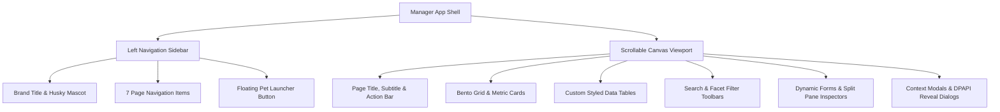

# Pet Animal Manager — Design Specification & Redesign System (Google Stitch Edition)

> **Document Type**: Comprehensive UI/UX Design Specification & Prompt Blueprint  
> **Target Tool**: Google Stitch / Figma / v0 / Claude Artifacts  
> **Application**: Pet Animal 2.0 Desktop Companion — Native Manager Application  
> **Platform**: Windows 11 Desktop (PyQt6 / Web-Hybrid Redesign Blueprint)  
> **Design Philosophy**: Modern Fluent / Bento-Grid / Privacy-First Offline Companion  
> **Version**: 2.5 Design Master  

---

## 1. Executive Summary & Product Vision

### 1.1 Product Purpose
**Pet Animal Manager** is the desktop command center for an offline, privacy-first Windows desktop companion (a friendly floating Husky companion on the user's screen). While the desktop companion lives as a frameless, transparent, floating pet widget with quick voice/text interactions, the **Manager Application** provides a deep management cockpit. 

In the Manager App, users manage:
1. **Dashboard**: Companion status, system KPIs, activity telemetry, and memory health distribution.
2. **Personal Memory**: A local, zero-cloud knowledge vault encrypted via Windows DPAPI for credentials, bank cards, personal identity details, and preferences.
3. **Commands**: Allowlisted application launchers, HTTPS URL shortcuts, natural language intent understanding, and automatic software discovery.
4. **Workflows**: A drag-and-drop linear visual automation routine builder (opening sequences of apps, URLs, folders, files, delays, and companion messages).
5. **Pet Studio**: Companion customization engine (real-time sprite scaling, chat bubble dimensions, typography, animations, and sprite sheet importer).
6. **Activity**: Privacy-conscious execution audit log with detailed step-by-step workflow inspection.
7. **Settings**: Theme modes (Light/Dark), voice recognition engines (Whisper Tamil-English, Google Speech), local file search indexer (Everything CLI integration), and database backup/restore.

### 1.2 Redesign Goals for Google Stitch
This document serves as a complete prompt and design specification for **Google Stitch** to redesign the Pet Animal Manager app from its traditional desktop UI into an **ultra-modern, visually stunning, polished Windows 11 / Fluent / Bento-style desktop interface**:
- **Modern Glass & Bento Architecture**: Clean card surfaces with subtle borders, gentle ambient drop shadows, and balanced negative space.
- **Unified Visual Hierarchy**: Clear typographic scale, purposeful color accents, and crisp visual indicators.
- **Zero-Friction Ergonomics**: Responsive split panes, streamlined filtering, intuitive drag-and-drop routine building, and instant inline feedback.
- **Security-First UX**: Elegant visual affordances for Windows DPAPI encrypted values (masked tokens, explicit reveal triggers, and badge indicators).

---

## 2. Design System Tokens & Style Guide

### 2.1 Color Palettes

#### Primary Accent Tokens
| Token Name | Hex Code | Role / Usage |
| :--- | :--- | :--- |
| `primary.default` | `#3368A0` | Main brand blue, primary buttons, active navigation, progress fills |
| `primary.hover` | `#4B80B8` | Button hover state, interactive accent hover |
| `primary.active` | `#255282` | Button pressed/active state |
| `primary.light` | `#EBF3FB` | Primary tint background, badge backgrounds in light mode |
| `primary.dark_tint`| `#1E293B` | Primary tint background in dark mode |
| `accent.cyan` | `#66A3BF` | Secondary brand cyan, highlight rings, slider hover handles |

#### Light Theme Palette (`theme.light`)
| Token | Hex Value | Usage |
| :--- | :--- | :--- |
| `bg.canvas` | `#F7F9FC` | Global application window background |
| `bg.surface` | `#FFFFFF` | Card surfaces, sidebar background, modals, inputs |
| `bg.subtle` | `#F1F5F9` | Table header background, secondary container, search bars |
| `text.primary` | `#1F2937` | Headings, primary text, prominent data labels |
| `text.muted` | `#64748B` | Subheadings, descriptions, secondary metadata, placeholders |
| `border.default`| `#E2E8F0` | Card borders, table dividers, input borders (1px solid) |
| `border.focus` | `#3368A0` | Input focus rings, selected card borders |
| `state.selection`| `#E0E7FF` | Table row selection, list item hover/selection |

#### Dark Theme Palette (`theme.dark`)
| Token | Hex Value | Usage |
| :--- | :--- | :--- |
| `bg.canvas` | `#111827` | Global application window background (deep slate) |
| `bg.surface` | `#1F2937` | Card surfaces, sidebar container, modals |
| `bg.subtle` | `#162032` | Secondary containers, table header background |
| `text.primary` | `#F7F9FC` | High-contrast white/light text |
| `text.muted` | `#A6B5C9` | Subdued metadata, secondary labels |
| `border.default`| `#374151` | Subtle container outline borders |
| `border.focus` | `#66A3BF` | Accent focus rings |
| `state.selection`| `#374151` | Table row selection in dark mode |

#### Semantic Status Tokens
| State | Light Mode | Dark Mode | Usage |
| :--- | :--- | :--- | :--- |
| **Success** | `#16A34A` (bg: `#DCFCE7`) | `#22C55E` (bg: `#14532D`) | Successful run, active status, valid items |
| **Warning** | `#D97706` (bg: `#FEF3C7`) | `#F59E0B` (bg: `#78350F`) | Needs review, conflict detected, expired |
| **Danger** | `#DC2626` (bg: `#FEE2E2`) | `#EF4444` (bg: `#7F1D1D`) | Execution failed, delete actions, error notices |
| **Info / Running** | `#2563EB` (bg: `#DBEAFE`) | `#3B82F6` (bg: `#1E3A8A`) | In-progress routine run, informational alerts |
| **Encrypted / Lock**| `#7C3AED` (bg: `#EDE9FE`) | `#A855F7` (bg: `#581C87`) | DPAPI encrypted sensitive records |

---

### 2.2 Typography Scale
- **Font Family**: `Segoe UI Variable`, `Segoe UI`, `Inter`, system-ui, sans-serif
- **Monospace Font**: `Cascadia Code`, `Consolas`, monospace (for DPAPI masked tokens, keys, file paths)

| Style Token | Size | Weight | Line Height | Usage |
| :--- | :--- | :--- | :--- | :--- |
| `font.brand` | 20px | 700 (Bold) | 24px | Sidebar app title ("PET ANIMAL") |
| `font.display` | 28px | 700 (Bold) | 36px | Page main heading |
| `font.headline` | 20px | 600 (SemiBold) | 28px | Section headings, dialog titles |
| `font.subhead` | 17px | 600 (SemiBold) | 24px | Card headers, group titles |
| `font.metric` | 32px | 700 (Bold) | 38px | KPI dashboard statistic numbers |
| `font.body` | 13px | 400 (Regular) | 20px | Standard body copy, inputs, table items |
| `font.body_bold` | 13px | 600 (SemiBold) | 20px | Table column headers, button labels |
| `font.caption` | 11px - 12px | 500 (Medium) | 16px | Badges, timestamps, helper descriptions |

---

### 2.3 Spacing, Radius & Elevation System

#### Radii
- `radius.sm`: `6px` (chips, inline badges)
- `radius.md`: `8px` (inputs, select dropdowns, icon buttons)
- `radius.lg`: `10px` (standard buttons, list items)
- `radius.xl`: `14px` - `16px` (cards, containers, modals)
- `radius.full`: `9999px` (pills, status dots, avatar circle)

#### Spacing Scale
- `space-1`: `4px`
- `space-2`: `8px`
- `space-3`: `12px`
- `space-4`: `16px`
- `space-5`: `20px`
- `space-6`: `24px`
- `space-8`: `32px`
- `space-10`: `40px`

#### Elevation & Shadows
- **Card Shadow (Light)**: `0 2px 8px -2px rgba(15, 23, 42, 0.06), 0 1px 3px 0 rgba(15, 23, 42, 0.04)`
- **Modal Shadow**: `0 20px 25px -5px rgba(15, 23, 42, 0.15), 0 8px 10px -6px rgba(15, 23, 42, 0.1)`
- **Border Treatment**: 1px crisp outline border using `border.default` (`#E2E8F0` / `#374151`).

---

## 3. Global App Shell & Navigation Architecture

### 3.1 Window Dimensions & Behavior
- **Default Resolution**: 1200 px × 900 px
- **Minimum Dimensions**: 850 px × 650 px (window is resizable and responds fluidly)
- **Compact Breakpoint**: `< 1100 px` (automatically transitions two-column layouts like Workflows into stacked vertical flows)
- **Always Accessible**: Closing the Manager window hides it to system tray if the pet or tray icon is active; if both are hidden, the Manager stays accessible to prevent lockout.

```
┌────────────────────────────────────────────────────────────────────────────────────────┐
│  PET ANIMAL MANAGER                                                           —  □  ✕  │
├─────────────────┬──────────────────────────────────────────────────────────────────────┤
│ [LOGO]          │  [PAGE HEADING]                                 [ACTION BUTTONS]     │
│ PET ANIMAL      │  Subtitle description of page context                                │
│ Desktop Buddy   ├──────────────────────────────────────────────────────────────────────┤
│                 │                                                                      │
│  ☰ Dashboard    │  [MAIN CONTENT AREA - Fluid Scrollable Canvas]                      │
│  🧠 Memory      │                                                                      │
│  ⚡ Commands     │  • Bento Grid Cards                                                  │
│  🔀 Workflows    │  • Data Tables                                                       │
│  🎨 Pet Studio  │  • Multi-facet Filter Bars                                           │
│  ⏱ Activity     │  • Split Pane Inspectors                                             │
│  ⚙ Settings     │                                                                      │
│                 │                                                                      │
│ ─────────────── │                                                                      │
│ [🚀 Open Pet]   │                                                                      │
└─────────────────┴──────────────────────────────────────────────────────────────────────┘
```

### 3.2 Left Sidebar Navigation (210px Fixed Width)
- **Top Header**:
  - Brand Logo Icon: Husky companion silhouette or stylized paw (`#3368A0`).
  - Brand Title: **`PET ANIMAL`** (20px bold, `#3368A0`).
  - Tagline: *"Your desktop companion"* (12px muted).
- **Navigation Menu List**:
  - Vertical list of 7 navigation items with smooth hover state (`#F1F5F9` / `#374151`) and active state (Pill fill `#3368A0` with crisp white text).
  1. `Dashboard` (Icon: Layout Dashboard)
  2. `Memory` (Icon: Brain / Vault)
  3. `Commands` (Icon: Zap / Terminal)
  4. `Workflows` (Icon: Git Branch / Workflow)
  5. `Pet Studio` (Icon: Palette / Pet Dog)
  6. `Activity` (Icon: History / Clock)
  7. `Settings` (Icon: Sliders / Settings)
- **Bottom Pinned Action**:
  - Full-width primary button: **`Open floating pet`** (Icon: Sparkles / External Window).
  - Triggers the frameless desktop Husky companion onto the Windows desktop.

---

## 4. Detailed Screen Specifications

---

### Page 1: Dashboard (`/dashboard`)
*The daily pulse and companion control center.*

```
┌─────────────────────────────────────────────────────────────────────────────────────┐
│ Welcome back, Alex 👋                                    [+ Add memory] [⚡ New cmd] │
│ A little companion. A more personal workspace.                                      │
├───────────────────────┬─────────────────────────────┬───────────────────────────────┤
│ 🧠 Memory items       │ ⚡ Registered commands      │ ⏱ Executed today             │
│ 42                    │ 18                          │ 12                            │
│ Saved on this PC      │ Phrases you control         │ From command history          │
├───────────────────────┴─────────────────────────────┴───────────────────────────────┤
│ 🐶 ACTIVE COMPANION                                                                 │
│   ┌────────┐   Husky · On your desktop                                              │
│   │ Sprite │   Asset: Default Husky (6 frames idle loop)                            │
│   └────────┘   [▶ Launch floating pet]   [⏸ Hide floating pet]                      │
├─────────────────────────────────────────┬───────────────────────────────────────────┤
│ ⏱ RECENT ACTIVITY                       │ 📊 MEMORY BREAKDOWN                       │
│ 10:45 AM  Open Chrome      • Success    │ Personal (12)      ████████████░░░░ 65%   │
│ 10:30 AM  Start Work Flow  • Success    │ Credentials (8)    ████████░░░░░░░░ 40%   │
│ 09:15 AM  Unknown command  • Fallback   │ Payment Cards (4)  ████░░░░░░░░░░░░ 20%   │
│ 08:50 AM  Remember email   • Success    │ Notes & Work (18)  ████████████████ 90%   │
│ [View all activity ➔]                   │ [Open memory vault ➔]                     │
└─────────────────────────────────────────┴───────────────────────────────────────────┘
```

#### Key Components:
1. **Header Action Bar**:
   - Greeting: Personalized with stored `user.name` memory ("Welcome back, {Name}" or "Welcome back").
   - Quick Actions: `Add memory` (Brain icon), `New command` (Primary, Zap icon).
2. **KPI Metric Bento Row (3 Cards)**:
   - Metric 1: Total Memories saved locally (e.g. `42`), caption *"Saved on this PC"*.
   - Metric 2: Registered Commands (e.g. `18`), caption *"Phrases you control"*.
   - Metric 3: Today's Executions (e.g. `12`), caption *"From command history"*.
3. **Active Companion Card**:
   - High-DPI preview of the current active Pet sprite (120×120px cropped from horizontal sprite sheet).
   - Companion metadata: Name, animation state, and live status badge (*"On your desktop"* [green dot] or *"Resting"* [gray dot]).
   - Quick Controls: `Launch floating pet` (Primary blue) and `Hide floating pet` (Ghost button).
4. **Recent Activity Feed Card**:
   - Displays last 4 command executions with timestamp, command name, and status pills (`Success` in green, `Failed` in red).
   - Link button: `View all activity` with right arrow navigation to Page 6.
5. **Memory Overview Card**:
   - Categorical breakdown of stored memories (Personal, Credentials, Banking, Work, etc.).
   - Visual progress bars showing relative proportion of total records.
   - Link button: `Open memory` with right arrow navigation to Page 2.

---

### Page 2: Personal Memory Vault (`/memory`)
*Local zero-cloud encrypted personal data store with Windows DPAPI encryption.*

```
┌─────────────────────────────────────────────────────────────────────────────────────┐
│ Personal memory                                                       [+ Add memory]│
│ Your profile, preferences and knowledge, saved locally and under your control.      │
├─────────────────────────────────────────────────────────────────────────────────────┤
│ 🔍 [Search title, key or value...           ] [All categories ▾]                    │
│ [All scopes ▾]   [All states ▾]   [Sort: Recently updated ▾]                        │
│ Status: Total: 42 • Active: 39 • Disabled: 3 • Sensitive (DPAPI Encrypted): 12     │
├─────────────────────────────────────────────────────────────────────────────────────┤
│ DATA TABLE                                                                          │
│ Title              │ Category        │ Value           │ Scope  │ Used │ Enabled    │
│ ───────────────────┼─────────────────┼─────────────────┼────────┼──────┼─────────── │
│ Full Name          │ Personal        │ Alex Johnson    │ Global │ 45   │ ● Yes      │
│ Email ID           │ Personal        │ alex@work.com   │ Global │ 18   │ ● Yes      │
│ GitHub Token       │ Passwords       │ •••••••• [🔒]   │ Global │ 12   │ ● Yes      │
│ Visa Platinum      │ Payment Cards   │ •••••••• [🔒]   │ Global │ 6    │ ● Yes      │
│ Project Temp Code  │ Work            │ PR-4921         │ Temp   │ 2    │ ○ No       │
├─────────────────────────────────────────────────────────────────────────────────────┤
│ 🔍 MEMORY DETAILS CARD (Split View / Drawer)                                        │
│   Title: GitHub Token                    Key: github.personal.token                 │
│   Value: ••••••••••••••••••••••••••••    [👁 Reveal value] (Requires Windows Auth)  │
│   Category: Passwords & Credentials      Scope: Global                              │
│   Created: 12 Sep 2026, 14:20            Last Used: Today, 10:45 AM (12 times)      │
│   Security: 🔒 Windows DPAPI hardware-tied encryption                               │
│   Actions: [✏ Edit memory]   [⏸ Disable]   [🗑 Delete memory]                        │
├─────────────────────────────────────────────────────────────────────────────────────┤
│ FOOTER ACTIONS                                                                      │
│ [📦 Safe export (JSON)]  [📥 Import memories]  [🔐 Full DPAPI Backup]  [🧹 Clean Expired] │
│ ℹ Safe JSON exports exclude sensitive categories. Full backups retain DPAPI keys.   │
└─────────────────────────────────────────────────────────────────────────────────────┘
```

#### Key Components:
1. **Search & Filter Matrix**:
   - Live query input searching `title`, `key`, and unmasked `value`.
   - Category filter dropdown (`Personal`, `Passwords & Credentials`, `Credit & Debit Cards`, `Work`, `Custom`).
   - Scope filter (`Global`, `Temporary`).
   - State filter (`All states`, `Enabled`, `Disabled`).
   - Sort dropdown (`Recently updated`, `Recently used`, `Most used`).
   - Memory Health Indicator: Live badge strip showing `Total`, `Active`, `Disabled`, and `Sensitive` count.
2. **Encrypted Data Table**:
   - Column layout: `Title`, `Category`, `Value`, `Scope`, `Used (Count)`, `Enabled`.
   - **Sensitive Data Security Rule**: Any record flagged sensitive automatically renders as masked dots `••••••••` with a lock glyph.
3. **Memory Inspector / Details Card**:
   - Appears when a row is selected.
   - Shows complete key-value details, creation & access timestamps, and usage count.
   - **DPAPI Reveal Button**: Clicking `Reveal value` performs on-demand Windows DPAPI unprotect and displays the secret with an active `Hide value` toggle.
4. **Data Management Footer**:
   - `Safe export`: Exports non-sensitive records to portable JSON (zero secret leakage risk).
   - `Import memories`: Validates schema, previews conflicts, and allows safe merging.
   - `Full encrypted backup`: Takes full encrypted SQLite database snapshot.
   - `Clean expired memories`: Automatically purges temporary memories past TTL.
5. **Add / Edit Memory Modal Window (Context-Aware Form)**:
   - Dynamic form adapts based on chosen Category:
     - **If Personal**: Quick-select presets (`Name`, `Address`, `Mobile number`, `Email ID`, `IDs`, `Custom`). Auto-slugs key (e.g. `user.name`, `email.id`).
     - **If Passwords**: Prompts for *Website or app name* (e.g. Google, GitHub) and *Password*, masking the secret.
     - **If Cards**: Dedicated structured inputs for *Card name / Bank*, *Card number* (formatted), *Expiry date (MM/YY)*, and *CVV*, securely combining them into encrypted payload.
     - **If Custom**: Standard title, key, value, scope (`GLOBAL` / `TEMPORARY`), and enabled toggle.
   - Automatic duplicate & conflict detection with confirmation prompt.

---

### Page 3: Commands & Software Discovery (`/commands`)
*Allowlisted voice/text command registry, NLP intent tester, and Windows software discovery.*

```
┌─────────────────────────────────────────────────────────────────────────────────────┐
│ Commands                                                              [+ New command]│
│ Registered phrases and natural requests for your enabled actions.                   │
├─────────────────────────────────────────────────────────────────────────────────────┤
│ REGISTERED COMMANDS TABLE                                                           │
│ Command Name       │ Trigger Phrases (Aliases)                    │ Status          │
│ ───────────────────┼──────────────────────────────────────────────┼──────────────── │
│ Google Chrome      │ open chrome • launch browser • chrome        │ ● Enabled       │
│ Notepad            │ open notepad • text editor • notepad         │ ● Enabled       │
│ VS Code            │ open code • visual studio code • editor      │ ● Enabled       │
│ Start Work Routine │ start my day • begin work • morning routine  │ ● Enabled       │
├─────────────────────────────────────────────────────────────────────────────────────┤
│ Actions: [✏ Edit selected]   [🔀 Edit in Workflows]   [▶ Test selected]   [🗑 Delete] │
│ ℹ Reserved: 'help' • 'remember my name as <name>' • 'what is my name'              │
├─────────────────────────────────────────────────────────────────────────────────────┤
│ 🧪 TEST COMMAND UNDERSTANDING (AI Intent NLP Tester)                                │
│ [ Input: "Can you open Chrome for me please?"                             ] [Test]  │
│ ┌─────────────────────────────────────────────────────────────────────────────────┐ │
│ │ Intent: APP_LAUNCH      Target: chrome        Confidence: 98% (EXACT ALIAS)     │ │
│ │ Resolved Command: Google Chrome               Execution: Dry-run / Not Executed │ │
│ └─────────────────────────────────────────────────────────────────────────────────┘ │
├─────────────────────────────────────────────────────────────────────────────────────┤
│ 💻 SOFTWARE DISCOVERY & SCANNER                                                     │
│ [ Tab: Approved Applications (14) ]  [ Tab: Discover Installed Software (Scan) ]    │
│ ┌─────────────────────────────────────────────────────────────────────────────────┐ │
│ │ [Search software...              ] [Filter: All ▾]    [🔄 Refresh Software]      │ │
│ │ App Name           │ Executable Path               │ Status    │ Action         │ │
│ │ Spotify            │ C:\Users\..\Spotify.exe       │ Detected  │ [+ Add Command]│ │
│ │ Slack              │ C:\Users\..\slack.exe         │ Approved  │ [✓ Registered] │ │
│ └─────────────────────────────────────────────────────────────────────────────────┘ │
└─────────────────────────────────────────────────────────────────────────────────────┘
```

#### Key Components:
1. **Commands Data Table**:
   - List of all voice/text triggers mapped to allowlisted apps, HTTPS URLs, and multi-step routines.
   - Shows Command Name, bulleted alias list, and Enabled/Disabled status chip.
   - Toolbar: `Edit selected`, `Edit in Workflows` (for routines), `Test selected` (instant execution), and `Delete`.
2. **AI Intent NLP Tester Card**:
   - Interactive scratchpad where the user types natural language queries (e.g. *"Could you launch my notepad?"*).
   - Real-time engine outputs: Resolved Intent (`APP_LAUNCH`, `WEB_SEARCH`, `FILE_SEARCH`, `WORKFLOW_RUN`, `MEMORY_RECALL`), target argument, confidence rating (e.g. 96%), and match type.
3. **Software Discovery & Management Tabs**:
   - **Tab 1: Approved Applications**: Table showing all approved Windows executables, canonical file paths, aliases, and quick edit/remove controls.
   - **Tab 2: Discover Software (Background Scanner)**:
     - Worker thread scans Start Menu, Registry, and standard paths safely without freezing the UI.
     - Live counter: *"X applications detected. Y added; Z launch commands auto-created"*.
     - One-click registration to turn any installed program into a companion-controllable command.
4. **New / Edit Command Dialog**:
   - Command Name input.
   - Action Type selector (`application` or `url`).
   - App Selector: Dropdown of all allowlisted Windows applications.
   - URL Input: Strict HTTPS input validation (rejects credentials, invalid ports, or unsafe schemes).
   - Phrases Input: Multiline text area (one trigger phrase per line).

---

### Page 4: Workflows & Routines Builder (`/workflows`)
*Visual multi-step automation routine builder with drag-and-drop sequencing.*

```
┌─────────────────────────────────────────────────────────────────────────────────────┐
│ Workflows                                                        [💾 Save] [▶ Run]  │
│ Build your routine once. Start it with a phrase or the Run button.       [■ Stop]   │
├──────────────────────┬──────────────────────────────────────────────────────────────┤
│ ROUTINES LIBRARY     │ VISUAL ROUTINE BUILDER & STEP CANVAS                         │
│ [🔍 Search routines] │ Routine Name: [ Morning Dev Setup                     ]     │
│                      │ Phrases: [ start work \n dev mode                     ]     │
│ • Morning Dev Setup  │ Status:  [x] Enabled                                         │
│   ● Enabled • Passed ├──────────────────────────────────────┬────────────────────────┤
│                      │ STEP SEQUENCE CANVAS                 │ STEP SETTINGS          │
│ • Finance Check      │ ◉ Trigger Phrase: "start work"       │ Action Type:           │
│   ● Enabled • Passed │ ↓                                    │ [ Open Application  ▾] │
│                      │ ┌──────────────────────────────────┐ │                        │
│ • Nightly Cleanup    │ │ 1. ▣ Open VS Code                │ │ Application:           │
│   ○ Disabled         │ ├──────────────────────────────────┤ │ [ Visual Studio Code▾] │
│                      │ │ 2. ↗ Open GitHub PRs (URL)       │ │                        │
│ [+ New routine]      │ ├──────────────────────────────────┤ │ Wait Duration:         │
│ [📋 Work template]   │ │ 3. ◷ Wait 2.50 seconds           │ │ [ 2.50 seconds     ] │
│ [📑 Duplicate]       │ ├──────────────────────────────────┤ │                        │
│ [🗑 Delete]          │ │ 4. ☏ Companion: "Have a great day"│ ℹ Opens VS Code safely │
│                      │ └──────────────────────────────────┘ │ without shell injection│
│                      │ ↓                                    │                        │
│                      │ ◎ Done                               │ [Choose file/folder...]│
│                      │ [+ Add Step]  [▲ Up]  [▼ Down] [✕ Del]                       │
└──────────────────────┴──────────────────────────────────────┴────────────────────────┘
```

#### Key Components:
1. **Split-Pane Architecture (Fluid Splitter)**:
   - Left Sidebar (220px): Routines library with real-time search, status badges (`Enabled`, `Disabled`, `⚠ Needs review`), and template buttons.
   - Right Canvas (Fluid): Visual step flow builder and step inspector.
   - **Responsive Adaptability**: When window width drops below 1100px, automatically stacks into a vertical top/bottom compact layout.
2. **Library Management Actions**:
   - `New routine`: Creates a fresh blank draft.
   - `Start Work template`: Pre-populates a productivity routine (Browser + Code + Folders).
   - `Duplicate`: Clones selected routine.
   - `Delete` & `Enable/Disable` toggles.
3. **Visual Step Canvas (Reorderable Flow)**:
   - Visual nodes connecting from `◉ Trigger Phrase` down to `◎ Done`.
   - Steps feature unique action icons:
     - `▣ Open App` (Application launcher)
     - `↗ Open URL` (HTTPS web link)
     - `▤ Open Folder` (Windows File Explorer)
     - `▧ Open File` (Associated default application)
     - `◷ Wait` (Configurable non-blocking delay: 0.0s to 90.0s)
     - `☏ Display Message` (Companion speech bubble toast)
   - Supports drag-and-drop reordering as well as `Move Up` / `Move Down` buttons.
4. **Step Settings Inspector**:
   - Contextual panel that updates dynamically according to the selected step:
     - For Application: Approved app dropdown.
     - For URL: HTTPS URL validator.
     - For Folder / File: Native Windows path picker (`Choose folder…` / `Choose file…`).
     - For Wait: Precision double spin box (seconds).
     - For Message: Companion speech bubble text input.
5. **Execution & Run Feedback Bar**:
   - Real-time `▶ Run` and `■ Stop` controls.
   - Step-by-step progress highlight during live execution with success/failure indicators.
   - Dirty-state guard (`Unsaved changes. Save before running`) with unsaved navigation prompt.

---

### Page 5: Pet Studio (`/pet-studio`)
*Companion personalization cockpit, geometry sliders, and sprite sheet manager.*

```
┌─────────────────────────────────────────────────────────────────────────────────────┐
│ Pet Studio                                                  [📥 Import PNG sheet]   │
│ Make your companion feel at home.                                                   │
├─────────────────────────────────────────────────────────────────────────────────────┤
│ 🐶 COMPANION APPEARANCE & BEHAVIOR CONFIGURATION                                    │
│                                                                                     │
│      ┌─────────────────────┐       ┌──────────────────────────────────────────┐     │
│      │                     │       │ Try “open notepad” or “what is my name”  │     │
│      │     (Animated       │       └──────────────────────────────────────────┘     │
│      │    Husky Sprite)    │                     ▲ Live Speech Bubble               │
│      │                     │                                                        │
│      └─────────────────────┘                                                        │
│         ▲ Live Pet Preview                                                          │
│                                                                                     │
│ Profile:          [ Default Husky (Active)                              ▾]          │
│ Companion Name:   [ Echo                                                 ]          │
│ Sprite Sheet:     [ Builtin Husky (petimage/idle.png)                   ▾]          │
│                                                                                     │
│ Pet Size:         [━━━━━━━●━━━━━━━━━━━━━━━━━━━━━━━━━━━━━] 160 px                    │
│ Chat Bubble Width:[━━━━━━━━━━━━━●━━━━━━━━━━━━━━━━━━━━━━━] 340 px                    │
│ Text Font Size:   [━━━━━●━━━━━━━━━━━━━━━━━━━━━━━━━━━━━━━]  13 px                    │
│                                                                                     │
│ Behavior Options: [x] Always on top (Floats above all Windows applications)         │
│                   [x] Enable Sprite Animations (6-frame idle animation loop)        │
│                                                                                     │
│ [💾 Save & activate profile]              [➕ Save as new profile]                  │
└─────────────────────────────────────────────────────────────────────────────────────┘
```

#### Key Components:
1. **Interactive Dual Live Preview**:
   - **Pet Sprite Preview**: Centered canvas rendering the actual cropped sprite frame, dynamically updating in real-time as the size slider moves.
   - **Speech Bubble Preview**: Floating translucent rounded balloon displaying custom theme background opacity, typography size, and max-width.
2. **Profile & Asset Controls**:
   - Profile selector dropdown (`Husky · active`, `Cat`, `Pixel Buddy`, etc.).
   - Pet Name input field.
   - Sprite Sheet picker (built-in assets + user-imported sheets).
3. **Geometry & Styling Sliders (With Live Numeric Badges)**:
   - **Pet Size**: `96 px` to `400 px` (default `160 px`).
   - **Chat Bubble Width**: `260 px` to `600 px` (default `340 px`).
   - **Chat Text Size**: `10 px` to `24 px` (default `13 px`).
4. **Companion Behavior Switches**:
   - `Always on top`: Windows desktop tool-window flag ensuring companion floats over IDEs, browsers, and full-screen games.
   - `Animations`: Enables/disables cyclic multi-frame sprite sheet animation loop (saves battery when disabled).
5. **Asset Importer (PNG Sprite Sheet Validator)**:
   - Header button: `Import PNG sheet`.
   - Enforces sprite sheet invariants:
     - Horizontal strip of square frames (width = height × N).
     - Dimensions: 16px ≤ height ≤ 512px.
     - 1 to 64 frames maximum, file size ≤ 8 MB.

---

### Page 6: Activity Audit Log (`/activity`)
*Privacy-first execution history with detailed routine run inspection.*

```
┌─────────────────────────────────────────────────────────────────────────────────────┐
│ Activity                                                            [🗑 Clear history]│
│ Registered command executions, separate from your memories.                         │
├─────────────────────────────────────────────────────────────────────────────────────┤
│ 🔍 FILTERS: [Status: All statuses ▾] [Command: All commands ▾] [Date: YYYY-MM-DD] [Apply]│
├─────────────────────────────────────────────────────────────────────────────────────┤
│ EXECUTION AUDIT TABLE                                                               │
│ Command Name       │ Trigger Phrase      │ Executed At       │ Status / Reason      │
│ ───────────────────┼─────────────────────┼───────────────────┼───────────────────── │
│ Google Chrome      │ "open chrome"       │ 07 Oct 2026, 11:20│ ● Success            │
│ Morning Dev Setup  │ "start work"        │ 07 Oct 2026, 09:00│ ● Success (4 steps)  │
│ Open Figma         │ "open figma"        │ 06 Oct 2026, 17:45│ ✕ Failed · Not found │
│ Remember Email     │ [system phrase]     │ 06 Oct 2026, 14:10│ ● Success            │
├─────────────────────────────────────────────────────────────────────────────────────┤
│ [🔍 Routine run details]                                                            │
│                                                                                     │
│ ┌─ ROUTINE RUN BREAKDOWN MODAL ───────────────────────────────────────────────────┐ │
│ │ Morning Dev Setup • Status: Success                                             │ │
│ │ 1. Open App: VS Code ➔ Success                                                  │ │
│ │ 2. Open URL: https://github.com ➔ Success                                       │ │
│ │ 3. Wait: 2.50s ➔ Completed                                                      │ │
│ │ 4. Display Message: "Ready!" ➔ Success                                          │ │
│ └─────────────────────────────────────────────────────────────────────────────────┘ │
└─────────────────────────────────────────────────────────────────────────────────────┘
```

#### Key Components:
1. **Privacy-Preserving Audit Log**:
   - Only records recognized registered commands or strictly masks unsupported phrases as `[unsupported command]`. Raw invalid inputs or typos are never stored, preventing accidental credential leaks.
   - Clear history button with two-step confirmation.
2. **Filter Toolbar**:
   - Status dropdown (`All statuses`, `success`, `failed`).
   - Command picker (`All commands` or specific action).
   - Date range selector (`YYYY-MM-DD`).
3. **Execution History Table**:
   - Columns: `Command`, `Phrase Triggered`, `Executed At (Local Time)`, `Status / Reason`.
4. **Routine Run Inspector Modal**:
   - Triggered by double-clicking a workflow row or clicking `Routine run details`.
   - Shows detailed execution trace for every step in the routine with individual step outcomes and error messages.

---

### Page 7: Settings & Data Management (`/settings`)
*Global system configuration, voice engines, local file search, and SQLite recovery.*

```
┌─────────────────────────────────────────────────────────────────────────────────────┐
│ Settings                                                                            │
│ Application preferences and local data management.                                  │
├─────────────────────────────────────────────────────────────────────────────────────┤
│ ⚙ GENERAL PREFERENCES                                                               │
│ Theme:              [ Dark Theme (Modern Slate)                           ▾]        │
│ Voice Recognition:  [ Multi-language (Tamil / English Whisper)            ▾]        │
│                     • Multi-language (Tamil / English Whisper - Offline)             │
│                     • Google Web Speech (Cloud Streaming - Requires Internet)       │
│                                                                                     │
│ Voice Global Hotkey:[x] Enable Ctrl + Windows for voice input                       │
│                     Hold Ctrl + Windows to speak. Release either key to submit.     │
│                     Status: ● Shortcut active and listening                         │
│ [Save preferences]                                                                  │
├─────────────────────────────────────────────────────────────────────────────────────┤
│ 🔎 LOCAL FILE SEARCH (Everything Engine & Fallback)                                 │
│ Search Folders (One per line):                                                      │
│ ┌─────────────────────────────────────────────────────────────────────────────────┐ │
│ │ D:\Projects                                                                     │ │
│ │ C:\Users\Alex\Documents                                                         │ │
│ └─────────────────────────────────────────────────────────────────────────────────┘ │
│ [+ Add folder...]                                                                   │
│ Everything CLI Client (es.exe):                                                     │
│ [ C:\Program Files\Everything\es.exe                                   ] [Browse...]│
│ ℹ Allows companion to instantly find files via '/package.xml' or 'find report.pdf'  │
│ [Save search settings]                                                              │
├─────────────────────────────────────────────────────────────────────────────────────┤
│ 💾 DATA & BACKUP RECOVERY                                                           │
│ [📦 Export configuration]     [📥 Import configuration]                              │
│ [🧠 Export memories (JSON)]    [🔐 Create database backup]                           │
│ [🔄 Restore database backup]   [🗑 Clear command history]                            │
│ ℹ Database restore performs an automated pre-flight recovery snapshot before apply. │
└─────────────────────────────────────────────────────────────────────────────────────┘
```

#### Key Components:
1. **General Preferences Card**:
   - **Theme Selector**: Light mode / Dark mode.
   - **Voice Engine Selector**:
     - *Multi-language (Tamil / English Whisper)*: High accuracy offline bilingual model.
     - *Google Web Speech*: Cloud-based streaming with language selector (`English (India)` or `Tamil (India)`).
   - **Push-to-Talk Hotkey Toggle**: `Ctrl + Windows` toggle with live status indicator.
2. **Local File Search Card**:
   - Custom search roots editor (multiline paths).
   - Optional Voidtools Everything CLI (`es.exe`) executable path selector.
   - Provides instant desktop indexing without telemetry or background indexing overhead.
3. **Data & Storage Management Card**:
   - Export/Import Configuration (syncs profiles, commands, settings without data loss).
   - Export Personal Memories (portable JSON).
   - SQLite Database Backup & Restore:
     - Automated integrity check (`PRAGMA integrity_check`).
     - Automatic pre-flight recovery snapshot before restoring any backup.

---

## 5. UI Component Hierarchy (For Google Stitch Generation)

When rendering or synthesizing the interface, Google Stitch should compose the UI using these atomic components:



### Component Atom Specifications

1. **Button Variants**:
   - `Primary Button`: Solid `#3368A0`, white bold text, 10px radius, subtle hover glow.
   - `Secondary / Ghost Button`: Transparent or surface background, 1px border `#E2E8F0` / `#374151`, text `#1F2937` / `#F7F9FC`.
   - `Danger Button`: Surface background with `#DC2626` text and hover fill.
   - `Icon Button`: 36×36px square with centered 16px SVG icon.
2. **Form Controls**:
   - `Text Input / Search`: Height 40px, padding 8px 12px, radius 8px, 1px border. Focus ring `#3368A0`.
   - `Dropdown Select (ComboBox)`: Custom chevron icon, smooth menu shadow, 8px radius.
   - `Slider (QSlider / Range)`: Custom 6px track `#E2E8F0` / `#374151`, active progress fill `#3368A0`, circular 16px thumb with hover highlight `#66A3BF`.
   - `Toggle Switch & Checkbox`: Fluent rounded checkbox with accent checkmark.
3. **Data Table Component**:
   - Clean borderless cells, 48px row height, subtle row dividers.
   - Column headers: Uppercase/semi-bold 12px muted text with 12px padding.
   - Row hover state: Subtle background tint (`#F1F5F9` / `#374151`).
   - Row selection state: Accent highlight (`#E0E7FF` / `#374151`).
4. **Status Chips & Pills**:
   - `Success Chip`: Green pill with green dot (`● Yes`, `● Enabled`, `● Passed`).
   - `Failure Chip`: Red pill with red cross (`✕ Failed`).
   - `Sensitive Encrypted Chip`: Purple pill with lock icon (`🔒 DPAPI Encrypted`).
   - `Warning Chip`: Amber pill (`⚠ Needs Review`).

---

## 6. Prompt Engineering Guide for Google Stitch

Use the following master prompt when uploading or prompting Google Stitch to redesign the Manager app:

```markdown
### MASTER PROMPT FOR GOOGLE STITCH

You are an expert UI/UX designer and design system architect specializing in modern desktop applications (Windows 11 Fluent 2 Design, macOS Sonoma aesthetics, and Bento-Grid interfaces).

Redesign the "Pet Animal Manager" desktop companion application based on the attached design specification.

#### Key Design Instructions:
1. **Aesthetic & Atmosphere**:
   - Deliver a hyper-polished, modern, clean desktop UI.
   - Use soft rounded corners (12px to 16px for cards, 8px for controls).
   - Use subtle 1px border outlines with light/dark contrast (`#E2E8F0` light, `#374151` dark).
   - Integrate modern Bento-grid card layouts for metric counters and overview panels.
   - Brand color accent is `#3368A0` (Husky Blue) with cyan highlights (`#66A3BF`).

2. **Screen Deliverables Required**:
   - **Screen 1: Dashboard**: Metric cards (Memories, Commands, Executions), Active companion card with sprite preview, recent activity stream, memory distribution bars.
   - **Screen 2: Personal Memory Vault**: Multi-facet filter bar, encrypted data table with masked DPAPI secrets (`••••••••`), and an interactive side-drawer/inspector with a "Reveal Value" button.
   - **Screen 3: Commands & Software Discovery**: Commands table, interactive AI Intent NLP tester scratchpad, and software scanner tab.
   - **Screen 4: Workflows Builder**: Split-screen routine automation builder. Left: routines list with badges. Right: visual node sequence flow (Start -> App -> URL -> Wait -> Message -> Done) with drag-and-drop step cards and step settings inspector.
   - **Screen 5: Pet Studio**: Companion personalization screen with live side-by-side animated Husky preview and speech bubble preview, interactive sliders for size/bubble width/font size, and sprite sheet importer.
   - **Screen 6: Activity Audit Log**: Tabular execution history with filter chips and a step-by-step routine execution trace modal.
   - **Screen 7: Settings**: General settings (Theme, Voice engines: Vosk/Whisper/Google, push-to-talk hotkey), Local file search path picker, and SQLite database recovery controls.

3. **Interactions & States to Showcase**:
   - Provide both Light Theme (`#F7F9FC` background) and Dark Theme (`#111827` slate background).
   - Include hover states, active states, modal dialogs (Add Memory, Add Command, Routine Run Trace), and empty states.
   - Explicitly highlight DPAPI security badges and unmasking affordances.
```

---

## 7. Verification Checklist & Invariants

When reviewing the redesigned output from Google Stitch, ensure all following domain invariants are respected:
- [x] **7 Core Pages Represented**: Dashboard, Memory, Commands, Workflows, Pet Studio, Activity, Settings.
- [x] **DPAPI Sensitive Data Masking**: Passwords and credit cards are never displayed in plain text without an explicit unmask action.
- [x] **Workflows 6 Step Types Supported**: Open App, Open URL, Open Folder, Open File, Wait, and Display Message.
- [x] **Voice Recognition Modes**: Shows Whisper Tamil/English (offline) and Google Speech (cloud).
- [x] **Pet Studio Sliders**: Size (96–400px), Chat Bubble Width (260–600px), Font Size (10–24px).
- [x] **Allowlisted Windows Dispatches**: Applications and URLs are strictly validated without arbitrary shell execution.
