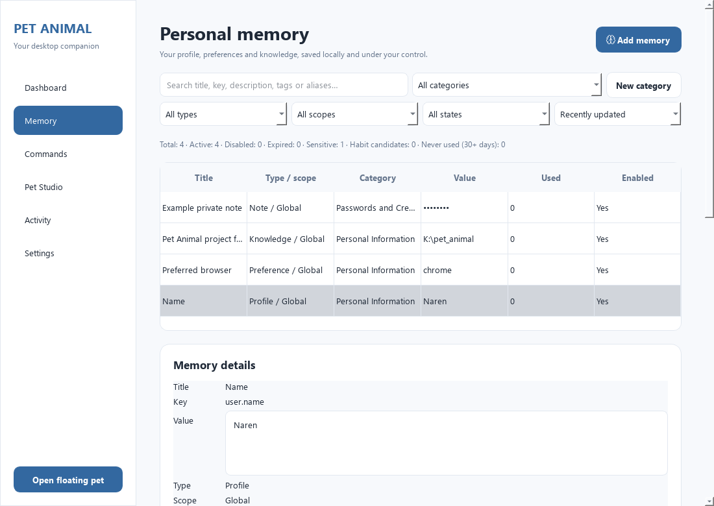
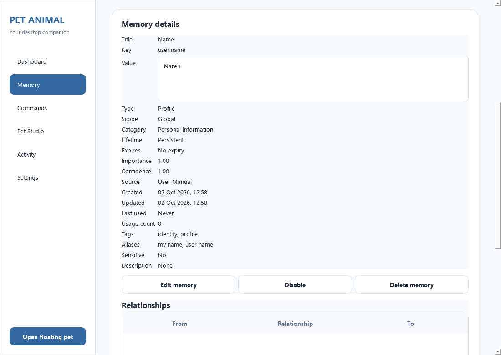

# Personal Memory Engine implementation and verification

Date: 2 October 2026.

## Architecture

The existing `ApplicationCore` and SQLite connection now expose a headless `MemoryService`, `MemoryRetriever` and `HabitEngine` under `src/core/memory`. The original `memories` table remains the authoritative store. There is no second database, AI model, embedding index, telemetry or memory network service.

```text
Manager / Pet input
        ↓
ApplicationCore and explicit memory intents
        ↓
MemoryService ── MemoryRetriever ── existing SQLite database
        │
        └── HabitEngine → candidates → user approval → HABIT memory

Remembered application preference
        ↓
MemoryResolver → current registered command → security checks → WindowsLauncher
```

The models include `MemoryType`, `MemoryScope`, `MemoryLifetime`, `MemorySource`, `MemoryQuery`, `MemoryMatch` and explicit conflict types. PROFILE, PREFERENCE, KNOWLEDGE, HABIT, RELATIONSHIP, NOTE, CONTEXT and SYSTEM records share one validation and sensitivity policy. GLOBAL, PROFILE, PET_PROFILE, SESSION and TEMPORARY scopes restrict applicability. Keys retain the original global uniqueness constraint; conflicting values, types and scopes require explicit handling.

The service owns CRUD, validation, tag/alias normalization, relationship operations, import planning, backup validation, access tracking and lifecycle. The GUI calls that API and presents confirmation dialogs. Legacy core wrappers remain available, including `save_memory`, `get_memory`, `get_memory_by_key`, `confirm_name`, and strict additive import.

## Database migration and existing records

`003_personal_memory_engine.sql` extends `memories` with type, scope, lifetime, importance, confidence, source, last-access timestamp, access count, expiry, runtime session ID and scope owner. It adds `memory_tags`, `memory_aliases`, `memory_relationships` and `habit_candidates`, with uniqueness constraints, cascading foreign keys and focused lookup indexes. `PRAGMA user_version` becomes 3. The shipped 001 and 002 migrations are unchanged.

Existing IDs, category IDs, values, descriptions, enabled flags, creation/update timestamps and DPAPI ciphertext survive unchanged. Existing `user.name` becomes PROFILE with importance 1.0; Important Notes become NOTE; other records default to KNOWLEDGE/GLOBAL/persistent with source MIGRATION and confidence 1.0. Known aliases are seeded once during migration without overwriting existing keys. User edits to aliases survive later restarts.

Migration 003 runs in a transaction; a failing migration rolls back its added columns and preserves the version-two data. Legacy version-one and version-two backups migrate only in an in-memory restore candidate; the source backup remains unchanged. Restores retain the strict full-schema comparison, integrity and foreign-key checks, command/action validation, settings validation, exactly one active pet, asset existence checks and current-user DPAPI decryption checks. New memory metadata, aliases, relationships and habit candidates are also validated. A recovery snapshot precedes replacement. Saved runtime sessions are removed from the restore candidate with child rows cascading.

## Retrieval and usage

`MemoryRetriever` provides exact/alias lookup, search, typed/tagged queries, structured relevant retrieval and relationship neighbors. Results use `MemoryMatch` with memory ID, key, masked/public value, score and match reason. Callers do not query SQLite directly.

Ranking is explainable:

| Match | Base score |
| --- | ---: |
| Exact key | 100 |
| Alias | 90 |
| Exact title | 80 |
| Type-only query | 70 |
| Tag | 60 |
| Relationship neighbor | 50 |
| Metadata/text match | 40 |

Small bonuses add twice the importance, confidence, recency up to 0.5, and capped logarithmic usage up to 0.5. These bonuses cannot overturn the primary match classes. Equal scores use the key and ID for stable ordering. There is no fuzzy execution or semantic retrieval.

Consumed retrieval increments `access_count` and updates `last_accessed_at`. Manager listing, filtering, details, Dashboard greeting and command understanding previews do not consume memory. Disabled, expired and foreign-profile records do not participate in retrieval. Sensitive values remain masked and are excluded from value-text search.

## Explicit commands and preferences

```text
remember my name as Naren
save my preferred browser as Chrome
remember my editor is VS Code
remember project.pet_animal.path as K:\pet_animal
what browser do I prefer
what is my editor
what is my pet animal project path
open my browser
open my editor
forget my preferred browser
```

Explicit `recall memory <alias>`, `what do you remember about <alias>` and `forget memory <alias>` support user-defined aliases without broad fuzzy lookup. Storage preserves original casing, paths and punctuation. Negative words in a recognized stored value remain data; negated action requests remain cancelled.

Saves and deletion create a runtime-only confirmation token. Nothing is persisted until confirmation. Tokens expire after five minutes, can be cancelled, cannot be replayed, and reject changed records, session/profile changes and attempts to edit another profile's record. Aliases retain the existing canonical key. Sensitive records can be changed or revealed through the Manager. Explicit memory grammar takes precedence even over legacy registrations that predate the new reserved phrases. Memory values and memory operations never enter command history.

`preferred.browser = chrome` and `preferred.editor = vscode` influence indirect open requests. A preference can resolve only to an allowlisted or approved registered application ID/alias, then must match an enabled registered command. Ambiguous commands, disabled or missing applications, unsafe paths, invalid action configuration, sensitive preferences and confidence below 0.85 block execution. Preference access is recorded only after application/path validation; expiration at consumption blocks launch. Legacy Chrome/VS Code defaults remain available only when no preference record exists. A saved but unavailable or foreign-profile preference blocks that fallback.

## Lifecycle and habit engine

Session records use a generated runtime session ID and are removed on clean shutdown and startup after an unclean exit. Temporary records have an expiry timestamp, defaulting to five minutes when omitted. Startup removes expired records; retrieval excludes records that expire during the current run. The Manager can inspect current-run expired records and clean them after confirmation. There are no per-record timers. `set_context` and structured profile methods provide narrow APIs for explicitly requested operational and personal state.

On-demand habit analysis uses successful registered command executions in a 90-day window. Five executions of the same command or ten launches of the same application create a PENDING candidate. Failed, unsupported, deleted-command, memory and free-text search/music activity is excluded. Approval saves a HABIT record with source HABIT_ENGINE; it does not silently create a preference. Rejection has a 30-day cooldown and requires additional evidence before reconsideration. Candidates can also become ACCEPTED or EXPIRED. The engine does not infer personality or sensitive traits.

## Manager and portability

The Memory page has type, scope, category, enabled/disabled/sensitive/expired filters; recently-used and most-used ordering; metadata search; a detail panel; explicit reveal/hide; editable tags and aliases; relationship add/delete controls; factual health counts; candidate approval/rejection; expiry cleanup; safe JSON export; full SQLite backup; and import preview with duplicate/conflict/invalid counts and confirmation.

Safe export version 2 includes nonsensitive personal records, metadata, tags, aliases and relationships whose endpoints are exported. Sensitive, session and SYSTEM records are excluded. Version-one exports remain importable. Every record and relationship is validated before mutation, including enum/range/lifetime/scope consistency and alias ownership. Conflicting input requires confirmation; invalid imports are rejected atomically. The legacy `ApplicationCore.import_memories` wrapper remains strict and rejects duplicate/conflicting imports.

Category-based DPAPI remains authoritative. New types use the same encryption model; sensitive values are encrypted at rest, masked in lists/results, decrypted only on explicit reveal or restore verification, and excluded from plain JSON. SQLite backups retain that ciphertext. Logs do not contain memory values or private notes. Memory resolves metadata; all OS execution stays in the existing registered-command and launcher security pipeline.





The screenshots use temporary sample data and a 1100×780 viewport. Filters, table and details fit without horizontal scrolling; the remaining details/actions use normal vertical scrolling.

## Files added

- `src/core/memory/__init__.py`: public engine API.
- `src/core/memory/models.py`: models, enums, conflicts and importance defaults.
- `src/core/memory/service.py`: memory validation, storage, graph, lifecycle, portability and restore validation.
- `src/core/memory/retrieval.py`: exact/structured ranking and access consumption.
- `src/core/memory/habits.py`: deterministic activity candidates and approval.
- `src/database/migrations/003_personal_memory_engine.sql`: in-place schema evolution.
- `src/commands/interpreter/memory_rules.py`: explicit memory grammar.
- `src/commands/interpreter/memory_resolver.py`: secure indirect application resolution.
- `tests/test_memory_engine.py`: domain, lifecycle, ranking, graph, habits and security tests.
- `tests/test_memory_commands.py`: command, confirmation, preference and adversarial integration tests.
- `tests/test_memory_backup.py`: migration preservation, rollback and restore tests.
- `tests/test_memory_ui.py`: Memory page behavioral tests.
- `docs/screenshots/personal-memory-engine.png` and `personal-memory-details.png`: isolated UI verification.
- `docs/personal-memory-engine.md`: this implementation report.
- `docs/personal-memory-source-verification.json`, `docs/personal-memory-packaged-verification.json`, `docs/personal-memory-installer-verification.json`: executed release verification results.

## Files modified

- `src/core/application.py`: migration, engine construction, compatible wrappers, guarded confirmation, command routing, preference consumption and expanded restore validation.
- `src/app/controller.py`: generic memory confirmation and cancellation.
- `src/app/manager_window.py`: Personal Memory Manager and read-only Dashboard lookup.
- `src/commands/interpreter/__init__.py`, `models.py`, `normalizer.py`, `rule_based.py`: memory intent metadata, resolver export, explicit grammar and value-aware normalization.
- `src/main.py`: source/frozen memory smoke verification.
- `tests/test_application_core.py`, `tests/test_application_registration.py`: version-three assertions and a genuine shipped version-one backup fixture.
- `README.md`: user examples, memory behavior and architecture documentation.

## Executed verification

The final complete regression suite was executed on the settled code:

| Test group | Passed |
| --- | ---: |
| Existing tests | 548 |
| New engine tests | 76 |
| New command tests | 92 |
| New migration/backup tests | 7 |
| New Manager tests | 13 |
| New tests subtotal | 188 |
| Total | **736** |

Command: `.venv\Scripts\python.exe -m pytest -q --tb=short`.
Actual final result: **736 passed, 1 warning in 92.91 seconds**. The final UI suite also passed **13 tests**, including the markup-preservation regression for values and aliases displayed verbatim.

The pre-change baseline was **548 passed**. The only existing warning concerns the separately installed `standard-aifc` compatibility package used by `speech_recognition` on Python 3.14.

Source application self-test: **PASS**. It checks startup and schema version 3, memory commands, preferences, tags/aliases/relationships, access counts, DPAPI masking/safe export, session restore cleanup, on-demand analysis, all six Manager pages, existing software discovery, English/Tamil offline voice, live pet switching and shutdown.

Packaged application: **PASS**. The rebuilt `dist/v2/pet-animal/pet-animal.exe` ran the complete isolated self-test, including the Personal Memory Engine and existing voice/software features. The packaged data includes migration 003.

Installer payload: **PASS**. The rebuilt setup executable verified its archive CRC, extracted into a temporary directory and ran its embedded application's complete self-test. The report has `success: true` and `installer_archive_verified: true`.

Release command: `.\release\build.ps1 -SkipTests`, after the separately executed full test suite. Both bundled offline speech models were already present and their multilingual checksums matched the pinned files; no model download was needed.

Verification commands:

```powershell
.venv\Scripts\python.exe src/main.py --self-test build/personal-memory-source-verification.json
Start-Process -Wait -WindowStyle Hidden -FilePath .\dist\v2\pet-animal\pet-animal.exe -ArgumentList '--self-test', 'K:\pet_animal\docs\personal-memory-packaged-verification.json'
Start-Process -Wait -WindowStyle Hidden -FilePath .\dist\v2\Pet-Animal-2.0-Setup.exe -ArgumentList '--verify-payload', 'K:\pet_animal\docs\personal-memory-installer-verification.json'
```

SHA-256 of the final release artifacts:

```text
pet-animal.exe
0F7A0F20C6C030651FB5EE29B969F4098634DB55FC6C2A54C8250DA1961C78AA

Pet-Animal-2.0-Setup.exe
483B3D5AD4395EDA5167EF5C7805845CB3A4337FE95A357588FCA678863429DD
```

The installer is 698,685,990 bytes and includes the existing offline speech models. The source and packaged migration 003 have identical SHA-256 hashes.

No installer installation into the user's real profile or live microphone recording is performed by these isolated checks.
