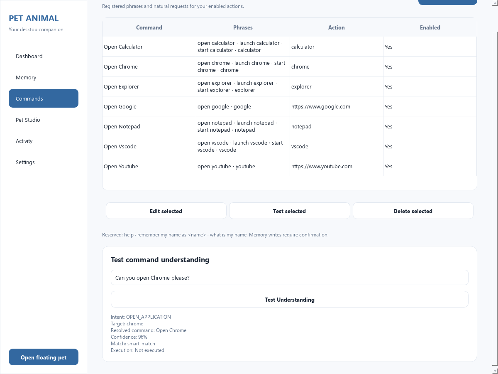

# Smart Command Understanding — implementation and verification

Verified on 2026-10-01 with the project Python 3.14.3 environment on Windows 11.

Smart Command Understanding extends the existing core rather than replacing the
registered action engine. Typed requests and speech transcripts now use the same
pipeline. Parsing is deterministic and local, with no new dependencies or AI
providers. The SQLite schema and DPAPI storage behavior are unchanged.

## Final command pipeline

```text
Typed text or speech transcript
    ↓
Input validity and command-level negation veto
    ↓
Reserved memory/help patterns and exact registered phrase matching
    ↓
Existing multilingual normalization and registered phrase matching
    ↓
RuleBasedIntentInterpreter → immutable CommandIntent
    ↓
IntentResolver → live registered command ID and confidence/state checks
    ↓
ApplicationCore.execute → reload enabled registration and validate action
    ↓
Existing WindowsLauncher / search / YouTube service
```

`ApplicationCore.interpret()` is a read-only API: it does not execute services,
write memory, decrypt secrets, append history, or emit mutation callbacks.
`IntentInterpreter` provides the extension interface for future interpreters.
The resolver derives meaning from existing `action_type` and `action_config`
metadata, without phrase similarity, synthetic registrations, or a migration.

Exact and custom registered phrases remain authoritative, including disabled
phrases. The mandatory negation veto applies even to an exact custom phrase.
Voice canonical phrases also preserve custom/disabled priority. Smart resolution
requires exactly one enabled matching registration; multiple enabled commands
for the same target return ambiguity. Confidence below 0.85 cannot auto-execute.

Search uses the existing registered Google website action as its capability
gate; media uses the registered YouTube website action. Disabling or removing
these actions prevents the corresponding browser service from executing. Browser
work stays on the existing `BrowserWorker` path when submitted through the GUI.
Reserved help/name operations retain their existing core handling and memory
confirmation; a name proposal never saves itself.

## Supported phrases

| Example | Meaning |
| --- | --- |
| `Can you open Chrome?` | Open registered Chrome action |
| `Launch Google Chrome for me` | Open registered Chrome action |
| `Could you bring up Chrome?` | Open registered Chrome action |
| `I need Chrome` | Open registered Chrome action |
| `Open the browser`, `Start my browser` | Explicit Chrome aliases |
| `Chrome ah open pannu`, `Chrome open pannunga` | Open registered Chrome action |
| `குரோம் ஓபன் பண்ணுங்க` | Open registered Chrome action |
| `Open my code editor`, `vs code start pannu` | Open registered VS Code action |
| `Open calc`, `calculator open pannu` | Open registered Calculator action |
| `Show file explorer` | Open registered Explorer action |
| `Take me to YouTube`, `google open pannu` | Open corresponding registered website |
| `Search Google for Salesforce DevOps` | Existing Google search service |
| `Look up Salesforce deployment best practices` | Existing Google search service |
| `Can you play Shape of You` | Existing YouTube playback service |
| `Shape of You song play pannu` | Existing YouTube playback service |
| `Save my name as Naren`, `my name is Naren, remember that` | Existing name confirmation |
| `Tell me my name`, `do you remember my name` | Existing explicit name retrieval |

Payload case follows the existing lowercase browser-command behavior. Words
inside query/song values are preserved, including `Please Please Me`,
`Save the Last Dance for Me`, and `Don't Stop Me Now`. Negated commands such as
`don't open chrome`, `chrome open panna vendam`, and `திறக்க வேண்டாம்` are rejected.
`open code` returns a VS Code clarification at 0.80 confidence. Unsupported
targets, arbitrary URLs, shell strings, and compounds such as `open chrome & calc`
cannot become smart application actions.

The Commands page includes **Test Understanding**, displaying intent, target,
resolved command, confidence, match reason, and **Execution: Not executed**.
The existing **Test selected** action continues to execute the configured command.
Normal pet responses contain no interpretation/debug fields.

## Security and privacy

- Interpreters and the resolver have no OS execution, GUI, or network dependency.
- App/website intent resolution requires a live enabled registration, and execution
  reloads it and invokes the existing action validator before calling the launcher.
- Only the launcher's five allowlisted application IDs can execute. Smart parsing
  cannot construct application paths or dispatch shell strings.
- Website actions retain HTTPS, credential, port, whitespace, and control-character
  validation. Searches remain encoded query values handled by the existing service.
- Negation, ambiguity, unsupported targets, missing/disabled commands, invalid
  input, and insufficient confidence fail without a launch.
- Unsupported history stores `[unsupported command]`; smart actions store their
  resolved registered phrase. Queries and song titles use existing redacted history
  markers. Diagnostic logs no longer include raw commands/search/media payloads.
- Name writes use the existing Yes/No confirmation, do not enter history, and use
  the same explicit `user.name` record. Sensitive memory encryption, masking,
  reveal, export, and restore checks are unchanged and covered by regression tests.

## Files added

| File | Purpose |
| --- | --- |
| `src/commands/interpreter/__init__.py` | Public interpretation API |
| `src/commands/interpreter/base.py` | Interpreter extension interface |
| `src/commands/interpreter/models.py` | Immutable intents/results, enums, threshold |
| `src/commands/interpreter/normalizer.py` | Conservative language-aware normalization |
| `src/commands/interpreter/patterns.py` | Central aliases and semantic templates |
| `src/commands/interpreter/rule_based.py` | Deterministic intent rules |
| `src/commands/interpreter/resolver.py` | Live registered-command metadata resolution |
| `tests/test_command_interpreter.py` | Intent, language, negation, and payload tests |
| `tests/test_command_normalizer.py` | Normalization and validity tests |
| `tests/test_intent_resolver.py` | Registration, confidence, state, and ambiguity tests |
| `tests/test_smart_commands.py` | Core/GUI integration and security regressions |
| `docs/smart-command-verification.md` | This report |
| `docs/smart-command-source-verification.json` | Final source self-test result |
| `docs/smart-command-packaged-verification.json` | Final frozen self-test result |
| `docs/smart-command-installer-verification.json` | Installer payload and extracted app verification |
| `docs/smart-command-artifact-hashes.json` | Test totals, latency measurements, release hashes |
| `docs/screenshots/smart-command-tester.png` | Visually inspected parse-only tester |

## Files modified

| File | Change |
| --- | --- |
| `README.md` | Shared pipeline, supported phrases, capability gates, privacy, tester usage |
| `pet-animal.spec` | Restore runtime assets/hooks, collect Vosk DLLs, filter incompatible ICU DLLs |
| `src/app/controller.py` | Send raw speech transcripts through the same core path as typed text |
| `src/app/manager_window.py` | Add the parse-only understanding tester |
| `src/app/pet_window.py` | Remove raw command/payload logging from compatibility callbacks |
| `src/commands/executor.py` | Log action/status without private payloads |
| `src/commands/parser.py` | Reuse central aliases/templates; redact parsing logs |
| `src/commands/voice_phrases.py` | Share vocabulary, recognize negation, preserve payload words |
| `src/core/application.py` | Read-only interpretation, resolution, guarded execution, reserved name aliases |
| `src/main.py` | Add smart-resolution, negation, and tester checks to the startup self-test |
| `src/services/windows_launcher.py` | Redact search diagnostics |
| `src/services/youtube_automation.py` | Redact search/song diagnostics |
| `src/services/youtube_worker.py` | Redact playback diagnostics |
| `tests/test_voice_bar.py` | Verify the intended shared typed/speech alias behavior with a real mock result |

The release build also regenerated ignored files under `build/` and `dist/v2/`.
Dependencies, migrations, stored profiles, and user data were not changed.

## Executed tests and checks

| Suite | Result |
| --- | --- |
| Existing test cases | 235 passed |
| New smart-command test cases | 209 passed |
| Final full suite | **444 passed**, 1 existing SpeechRecognition/aifc deprecation warning |
| Final source application self-test | Success |
| Final frozen application self-test | Success, process exit 0 |
| Installer archive CRC and extracted app self-test | Success, process exit 0 |
| Core/interpreter headless and offline import boundaries | Passed |
| `git diff --check` | Passed |
| Commands tester visual inspection | Passed; full output visible through existing page scrolling |

The final full suite was executed with:

```powershell
$env:QT_QPA_PLATFORM='offscreen'
.venv/Scripts/python.exe -m pytest -q
```

The legacy voice-alias expectation that typed aliases were unsupported was updated
to verify the requested shared behavior. Existing security tests were preserved.
New integration tests cover custom/disabled precedence, deleted registrations,
duplicate targets, low confidence, corrupt configured actions, strict URL checks,
privacy, memory confirmation, and both typed/voice Qt signals.

Representative local latency measurements, without action execution: 1,000 rule
samples and 500 complete core samples for `Could you bring up Chrome for me?`.
Rule median **0.042 ms**; core median **0.265 ms**; core 95th percentile **0.350 ms**.
These measurements are a local observation, not a worst-case timing guarantee.

## Build verification

The final release was built with `release/build.ps1 -SkipTests` after the suite
passed separately. Existing speech assets were found locally and validated; no
new runtime model or interpretation dependency was introduced.

The pre-existing packaging specification omitted runtime resources and Vosk
native DLLs. It now includes migrations, UI assets, local speech models, the
existing native voice/diagnostic hooks, and Vosk DLLs. The first frozen check
exposed the missing Vosk libraries; the final rebuild passes the complete
source-equivalent self-test, including English/Tamil engines and decoding.

| Artifact | SHA-256 |
| --- | --- |
| `dist/v2/pet-animal/pet-animal.exe` | `04cc86190ff2f83a92417142c223b0076520766154b56312bc0a15c5f7fd0f50` |
| `dist/v2/Pet-Animal-2.0-Setup.exe` | `a12f89647a4eab2b131b88f72ad955fb1bc0e90f0c6108150facf3e8b4917daf` |

Application startup was verified through isolated offscreen self-tests, including
real Qt window construction and local speech-engine decoding. Live microphone
hardware, interactive installation/uninstallation, and real external application
launches or online playback were not exercised; service execution is mocked in
regression tests, and the self-tests perform no external launches.


