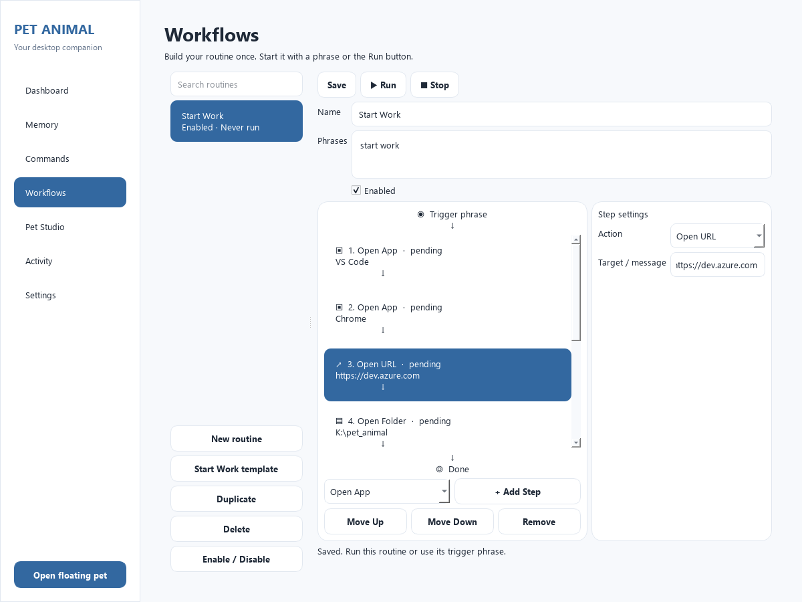
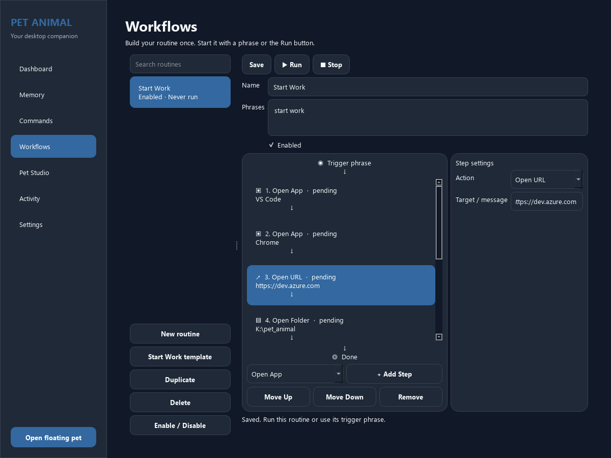
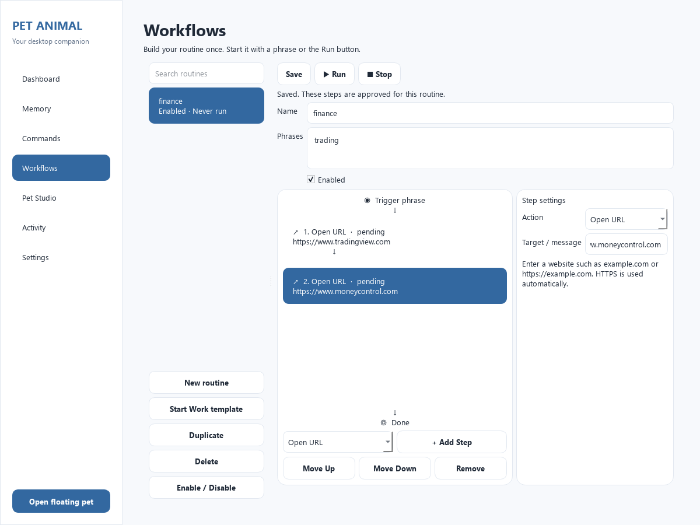
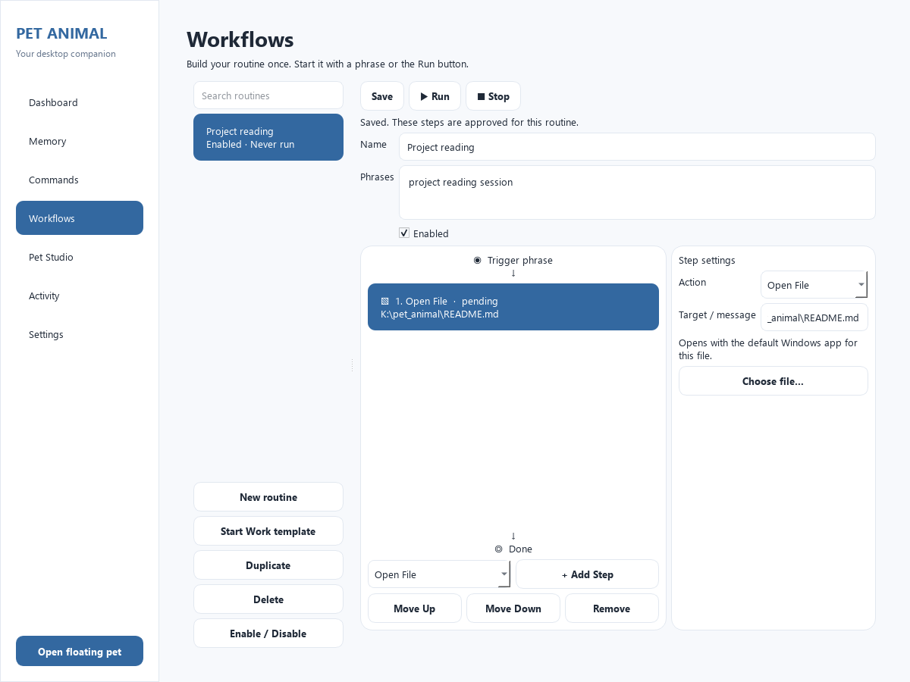

# Workflow Builder verification

Verified on 5 October 2026 using the project virtual environment on Windows.

## Results

- Full test suite: **937 passed**, one existing speech-recognition `aifc` deprecation warning.
- Source self-test: **passed**, including SQLite schema 7, seven Manager pages, and the complete
  VS Code → Chrome → HTTPS URL → local folder → local file → two-second wait → “Ready!” sequence.
- OS launch actions were mocked for workflow verification; no external applications or websites
  were opened by the acceptance scenario. Other existing self-test checks remain intact.
- Visual checks: light/dark themes at 1200 × 900 and 850 × 650; compact layout stacks vertically
  with scrolling. Drafts survive theme changes, notifications, and window resizing.
- `git diff --check`: passed.

## Covered behavior

Exact normalized triggers, reserved/duplicate phrase rejection, all six step types,
90-second wait and 100-character message limits, sequential asynchronous execution,
preflight and per-step target validation, stop-on-failure, cancellation during waits and
launcher calls, ignored stale callbacks, one active run, and protected active-routine edits.

Storage checks cover version 6 migration, older backup restore, routine/command transactional
CRUD, restart persistence, recovery of interrupted runs, private run outcomes, configuration
import remapping, disabled imported routines, malformed-import rollback, and clearing history.

UI checks cover step settings, actual Qt internal reordering, Move Up/Down, template validation,
search, duplicate drafts, enable/disable, Save/Discard/Cancel navigation, Commands integration,
progress states, Stop, and closing the Manager while execution continues.

## Use

Restart the source application and open **Manager → Workflows**. Choose **New routine** or
**Start Work template**, configure the URL and local folder, assign trigger phrases, then Save.
Run from the panel or type the saved phrase in the floating pet. URLs use the default browser.

The installer and packaged executable were not rebuilt as part of this source feature change.

## Previews

## Routine Save fix

Reproduced the silent save behavior with `finance` / `trading` and two addresses entered
without `https://`. Validation rejected them, but feedback was below the editor and easy
to miss, leaving the routine dirty and triggering the unsaved-changes prompt on navigation.

The builder now adds HTTPS to ordinary domain addresses before strict core validation.
Explicit HTTP, credentials, whitespace and invalid ports remain rejected. Confirmation and
step-specific errors appear next to the Save controls, and errors are scrolled into view.
Database write failures retain the draft and show visible feedback.

Regression checks save Finance with two domain-only or full HTTPS URLs, verify normalized
persisted targets, and confirm that switching panels does not show an unsaved prompt after
successful Save. Invalid/missing targets remain unsaved with visible errors. The full suite
passes 922 tests and the source self-test passes after this fix.

## Open File routine step

Added on 5 October 2026. **Open File** is available in both the Add Step picker and
step Action selector, with a native file picker. Windows opens the approved local
file using its default associated application (`os.startfile(path, 'open')`).

Approval and runtime checks reuse the existing fixed-local-disk and link/placeholder
protections. Executables, scripts and shortcuts stay in approved application steps.
Missing files or files without an associated application fail the step and skip later
steps. File targets are included in routine configuration and backup/import round trips,
while run history retains only the step type and sanitized outcome.

Verification: 98 targeted tests passed; full suite **937 passed**; source self-test passed
with a file step included. Tests mock OS launch requests, so no real documents were opened.

